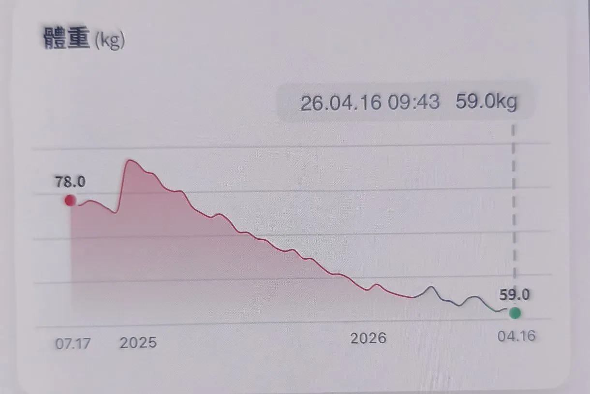

# Threads 貼文 DXRu7PeE-6B

- 帳號: [@drchenghao](https://www.threads.com/@drchenghao)（程皓醫師｜好動人生。 運動與家庭醫學，已認證）
- 貼文 URL: https://www.threads.com/@drchenghao/post/DXRu7PeE-6B
- 發文時間: 2026-04-18T22:53:53+08:00（UTC+8，時間戳 1776524033）
- 類型: photo
- 愛心數: 295
- 回覆數: 19
- 轉發數: 2
- 引用數: 1
- 備註: 貼文曾被編輯

## 貼文文字

猛健樂出來也接近一年的時間了

回顧去年，從剛出來的觀望、批評、質疑，
到後來的瘋狂熱潮，再到如今的肯定和驚訝

不僅許多朋友受惠於這藥物，
我也從每位朋友身上學習，也同樣大開眼界

底下分享，一位我很佩服的客戶的減重過程
______________________
這位朋友半信半疑的來，但在使用過程非常認真執行飲食控制和有氧、重訓，從85公斤降到目前59公斤，體脂從32降到22左右

後續目標是好好使用完一年，接著繼續維持良好習慣，她的感想是，原本飲控運動都做不到的事，現在有了輔助，竟然成功了

祝福所有朋友為了健康努力，減重順利

## 圖片

- 原始圖片 URL: https://scontent-sin6-3.cdninstagram.com/v/t51.82787-15/670738437_17940870339446758_4818812872069533816_n.webp?efg=eyJ2ZW5jb2RlX3RhZyI6InRocmVhZHMuRkVFRC5pbWFnZV91cmxnZW4uMTIyMC5zZHIucmVndWxhcl9waG90by5leHBlcmltZW50YWwifQ&_nc_ht=scontent-sin6-3.cdninstagram.com&_nc_cat=110&_nc_oc=Q6cZ2gG8rUcmXSvNr-nUBNlS40nyA2Tcjs7O1KHjUnFakRGfpFbcCX6tAosh3Cros7MmB_BFYxmMrmk41yOutpqLMz3I&_nc_ohc=oVVaPqLM6I4Q7kNvwH-FKDL&_nc_gid=MVeZReLuXUKWo1rEIuM6AA&edm=APs17CUBAAAA&ccb=7-5&ig_cache_key=Mzg3ODA4NzEzNTM0MjA5NjAwMQ%3D%3D.3-ccb7-5&oh=00_AQKTvwsDM2kxiifs9e9GWHvJvcXFmhX02W2riSF_Yz3GUA&oe=6AA5EE42&_nc_sid=10d13b
- 尺寸: 1220x815
