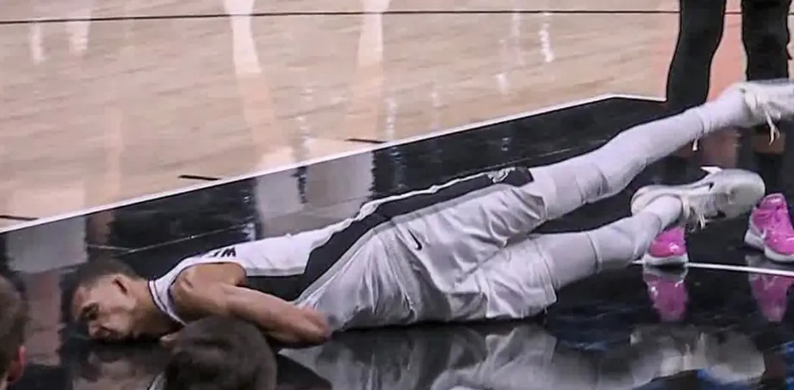

# Threads 貼文 DXapgBWE66j

- 帳號: [@drchenghao](https://www.threads.com/@drchenghao)（程皓醫師｜好動人生。 運動與家庭醫學，已認證）
- 貼文 URL: https://www.threads.com/@drchenghao/post/DXapgBWE66j
- 發文時間: 2026-04-22T09:59:39+08:00（UTC+8，時間戳 1776823179）
- 類型: photo
- 愛心數: 69
- 回覆數: 1
- 轉發數: 1
- 引用數: 1
- 備註: 貼文曾被編輯

## 貼文文字

斑馬下巴重擊，觸發腦震盪保護機制🥲
懶人包：若無症狀，回場時間落在1週內是合理的唷❗但若症狀出現，歸期就未定

腦震盪發生，最重要是避免再次撞擊，可能導致腦水腫或更嚴重問題

因此建議立即下場觀察，並且72小時持續追蹤❗

初期休息： 事件發生後至少休息 24-48 小時，避免高強度思考、用眼（如看手機、電腦）或劇烈運動。
症狀監測： 觀察頭痛、暈眩、情緒波動、注意力下降等症狀。

## 圖片

- 原始圖片 URL: https://scontent-sin6-3.cdninstagram.com/v/t51.82787-15/671197103_17942544042446758_2260505410478682770_n.webp?efg=eyJ2ZW5jb2RlX3RhZyI6InRocmVhZHMuRkVFRC5pbWFnZV91cmxnZW4uMTIwMC5zZHIucmVndWxhcl9waG90by5leHBlcmltZW50YWwifQ&_nc_ht=scontent-sin6-3.cdninstagram.com&_nc_cat=110&_nc_oc=Q6cZ2gG8rUcmXSvNr-nUBNlS40nyA2Tcjs7O1KHjUnFakRGfpFbcCX6tAosh3Cros7MmB_BFYxmMrmk41yOutpqLMz3I&_nc_ohc=cprZ-jQT8ikQ7kNvwFyO6XI&_nc_gid=MVeZReLuXUKWo1rEIuM6AA&edm=APs17CUBAAAA&ccb=7-5&ig_cache_key=Mzg4MDU5NjU0OTMwNzQ0NDg5OQ%3D%3D.3-ccb7-5&oh=00_AQJKG8luj6vU49CmeEdeRPIYfyyCMLwmQfBNLYSenE8rxA&oe=6AA5F527&_nc_sid=10d13b
- 尺寸: 1200x590
