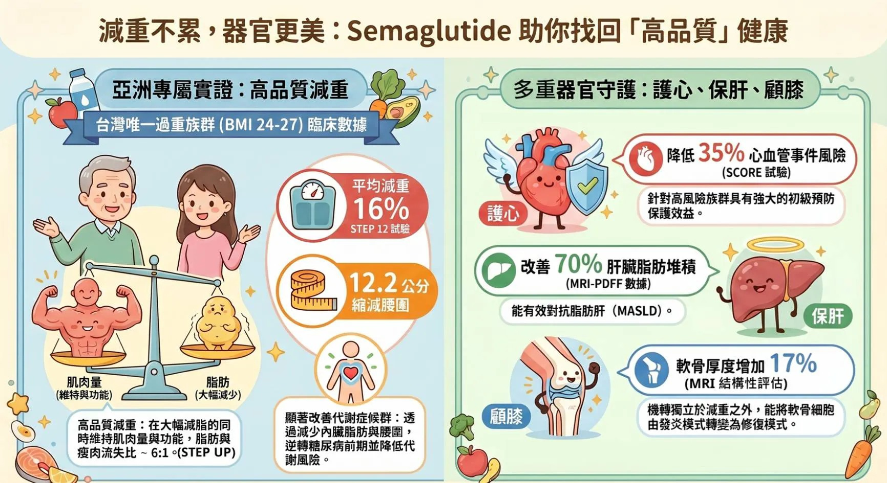

# Threads 貼文 DXgzmYjkyTL

- 帳號: [@drchenghao](https://www.threads.com/@drchenghao)（程皓醫師｜好動人生。 運動與家庭醫學，已認證）
- 貼文 URL: https://www.threads.com/@drchenghao/post/DXgzmYjkyTL
- 發文時間: 2026-04-24T19:23:21+08:00（UTC+8，時間戳 1777029801）
- 類型: photo
- 愛心數: 160
- 回覆數: 4
- 轉發數: 4
- 引用數: 2
- 備註: 貼文曾被編輯

## 貼文文字

瘦瘦針，不只是為了減重，
更多為了健康

週纖達、胰妥讚，護心、保肝、顧膝
▶️ 降低 35%心血管事件
▶️ 改善 70%肝臟脂肪堆積
▶️ 膝軟骨厚度增加17%（小型研究）

近幾個月客戶除了反饋體重減輕外，血糖和脂肪肝也都有大幅度改善，也有朋友分享膝蓋負擔改善許多

這個時代有這種藥物能使用，
真的是患者的福氣 🥹

## 圖片

- 原始圖片 URL: https://scontent-sin6-3.cdninstagram.com/v/t51.82787-15/674494538_17943698172446758_7373028520027037510_n.webp?efg=eyJ2ZW5jb2RlX3RhZyI6InRocmVhZHMuRkVFRC5pbWFnZV91cmxnZW4uMTczMi5zZHIucmVndWxhcl9waG90by5jMiJ9&_nc_ht=scontent-sin6-3.cdninstagram.com&_nc_cat=110&_nc_oc=Q6cZ2gFcvexf57abwSGDiBHf39tgueMW8EYTkzfgL6zQlFJWHHS0XSIbb1tCGIodR8ZLj5Ai9tEaQslJRUh8pmqFWTSR&_nc_ohc=02tKNzpwJpUQ7kNvwF0gMY-&_nc_gid=VL04ufGkeiDwEOKRzRR91w&edm=APs17CUBAAAA&ccb=7-5&ig_cache_key=Mzg4MjMyOTgxNjg3MjE5OTM3MQ%3D%3D.3-ccb7-5&oh=00_AQIn9JUZmPEmaqiuYp6rTrfV5_dICfFGErqKb-PNk-sVKg&oe=6AA5D4E3&_nc_sid=10d13b
- 尺寸: 1732x945
