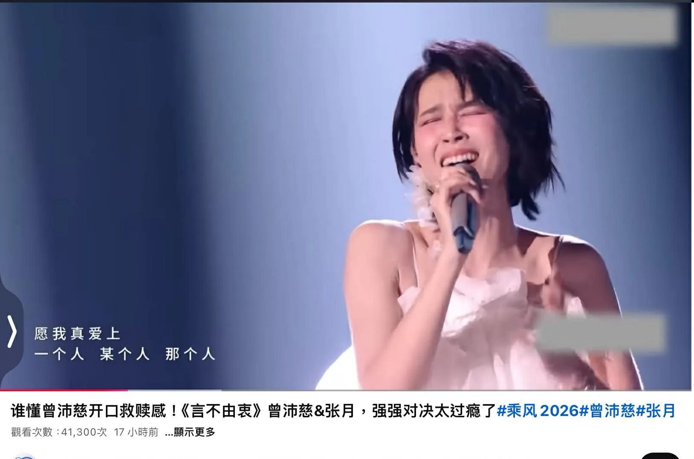

# Threads 貼文 DXmKivVEzUu

- 帳號: [@drchenghao](https://www.threads.com/@drchenghao)（程皓醫師｜好動人生。 運動與家庭醫學，已認證）
- 貼文 URL: https://www.threads.com/@drchenghao/post/DXmKivVEzUu
- 發文時間: 2026-04-26T21:20:01+08:00（UTC+8，時間戳 1777209601）
- 類型: photo
- 愛心數: 1437
- 回覆數: 28
- 轉發數: 8
- 引用數: 0
- 備註: 貼文曾被編輯

## 貼文文字

這首 曾沛慈 真的是純真唱...
尾音甚至連呼吸聲都沒修，還是好好聽
跟另一位開滿reverb、被修飾過、好聽到虛假、無法拉尾音的真的是有差別耶

## 圖片

- 原始圖片 URL: https://scontent-sin6-3.cdninstagram.com/v/t51.82787-15/681964415_17944698216446758_4487807044748639727_n.webp?efg=eyJ2ZW5jb2RlX3RhZyI6InRocmVhZHMuRkVFRC5pbWFnZV91cmxnZW4uMTYyOC5zZHIucmVndWxhcl9waG90by5jMiJ9&_nc_ht=scontent-sin6-3.cdninstagram.com&_nc_cat=110&_nc_oc=Q6cZ2gFcvexf57abwSGDiBHf39tgueMW8EYTkzfgL6zQlFJWHHS0XSIbb1tCGIodR8ZLj5Ai9tEaQslJRUh8pmqFWTSR&_nc_ohc=kbLm-U5ssRwQ7kNvwEO9mot&_nc_gid=VL04ufGkeiDwEOKRzRR91w&edm=APs17CUBAAAA&ccb=7-5&ig_cache_key=Mzg4MzgzODA5NjQwMDM5NzYxNA%3D%3D.3-ccb7-5&oh=00_AQJNQropGT-sRlJPjjXE0ZCv5EYrzJsuPGgZl6H1kTdAew&oe=6AA5F171&_nc_sid=10d13b
- 尺寸: 1628x1078
