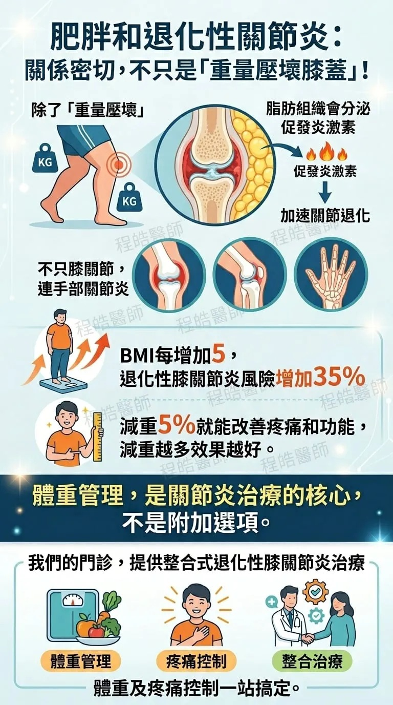

# Threads 貼文 DXrDlj2kyWz

- 帳號: [@drchenghao](https://www.threads.com/@drchenghao)（程皓醫師｜好動人生。 運動與家庭醫學，已認證）
- 貼文 URL: https://www.threads.com/@drchenghao/post/DXrDlj2kyWz
- 發文時間: 2026-04-28T18:55:27+08:00（UTC+8，時間戳 1777373727）
- 類型: photo
- 愛心數: 22
- 回覆數: 5
- 轉發數: 0
- 引用數: 1

## 貼文文字

膝蓋運動傷害、疼痛、退化，
你需要整合式體重控制、疼痛治療
重拾愛好生活😊

一位50歲女性，
長期受到膝蓋疼痛的困擾，雖然她曾接受玻尿酸注射治療，但疼痛依然時常發作。

最終，她來到我的門診，經過詳細評估後，我們決定採取一個綜合性的治療方案，重點在於體重控制、疼痛管理以及適當的肌力訓練。

治療四個月後👇
▶️ 體重從85公斤降至75公斤
▶️ 疼痛從4分降至1分
▶️ 糖尿病減藥至幾乎完全緩解
▶️ 開始回復原本跳舞日常

真正的好，不是痛好了而已，
是找回以前的自己，重拾愛好🥹

## 圖片

- 原始圖片 URL: https://scontent-sin6-3.cdninstagram.com/v/t51.82787-15/681270208_17945568018446758_4996818791623629647_n.webp?efg=eyJ2ZW5jb2RlX3RhZyI6InRocmVhZHMuRkVFRC5pbWFnZV91cmxnZW4uNzY4LnNkci5yZWd1bGFyX3Bob3RvLmMyIn0&_nc_ht=scontent-sin6-3.cdninstagram.com&_nc_cat=110&_nc_oc=Q6cZ2gFcvexf57abwSGDiBHf39tgueMW8EYTkzfgL6zQlFJWHHS0XSIbb1tCGIodR8ZLj5Ai9tEaQslJRUh8pmqFWTSR&_nc_ohc=XI6kds39sxEQ7kNvwG5W-be&_nc_gid=VL04ufGkeiDwEOKRzRR91w&edm=APs17CUBAAAA&ccb=7-5&ig_cache_key=Mzg4NTIxNDg3ODc5MzkzNDI1OQ%3D%3D.3-ccb7-5&oh=00_AQKvdBP509MPKPIAWcJ6IWW6PWSmDK6nkMuhvZAvWPZ1-w&oe=6AA5FB12&_nc_sid=10d13b
- 尺寸: 768x1376
