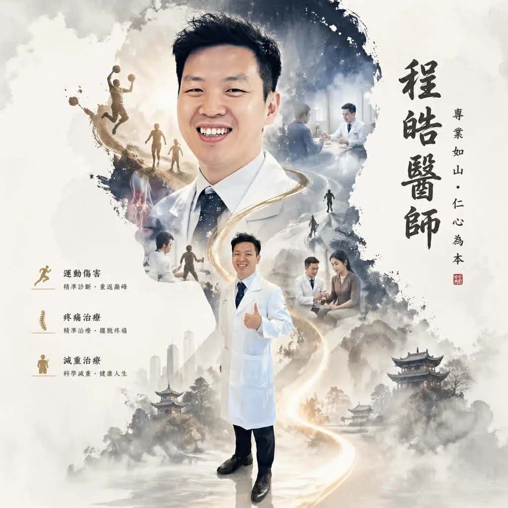

# Threads 貼文 DXsejV9E_-k

- 帳號: [@drchenghao](https://www.threads.com/@drchenghao)（程皓醫師｜好動人生。 運動與家庭醫學，已認證）
- 貼文 URL: https://www.threads.com/@drchenghao/post/DXsejV9E_-k
- 發文時間: 2026-04-29T08:10:19+08:00（UTC+8，時間戳 1777421419）
- 類型: photo
- 愛心數: 59
- 回覆數: 12
- 轉發數: 0
- 引用數: 0

## 貼文文字

早安各位朋友，這是今日份的長輩圖（？

我是程皓醫師，運動醫學科醫師
樂天隊醫，NBA勇士球迷
專注運動傷害、疼痛治療、減重治療
追蹤我了解更多醫學小知識唷~😄

## 圖片

- 原始圖片 URL: https://scontent-sin6-3.cdninstagram.com/v/t51.82787-15/681963384_17945896347446758_1014848725006224470_n.webp?efg=eyJ2ZW5jb2RlX3RhZyI6InRocmVhZHMuRkVFRC5pbWFnZV91cmxnZW4uMTAyNC5zZHIucmVndWxhcl9waG90by5jMiJ9&_nc_ht=scontent-sin6-3.cdninstagram.com&_nc_cat=110&_nc_oc=Q6cZ2gFcvexf57abwSGDiBHf39tgueMW8EYTkzfgL6zQlFJWHHS0XSIbb1tCGIodR8ZLj5Ai9tEaQslJRUh8pmqFWTSR&_nc_ohc=2hHgkOLDjNIQ7kNvwEtDDlv&_nc_gid=VL04ufGkeiDwEOKRzRR91w&edm=APs17CUBAAAA&ccb=7-5&ig_cache_key=Mzg4NTYxNDk0ODY2NDIxMzQxMg%3D%3D.3-ccb7-5&oh=00_AQLeODxzsaTexK-DW1OhhQt64ejSOdIAhdhqJu7IGHpFGw&oe=6AA5ECB4&_nc_sid=10d13b
- 尺寸: 1024x1024
