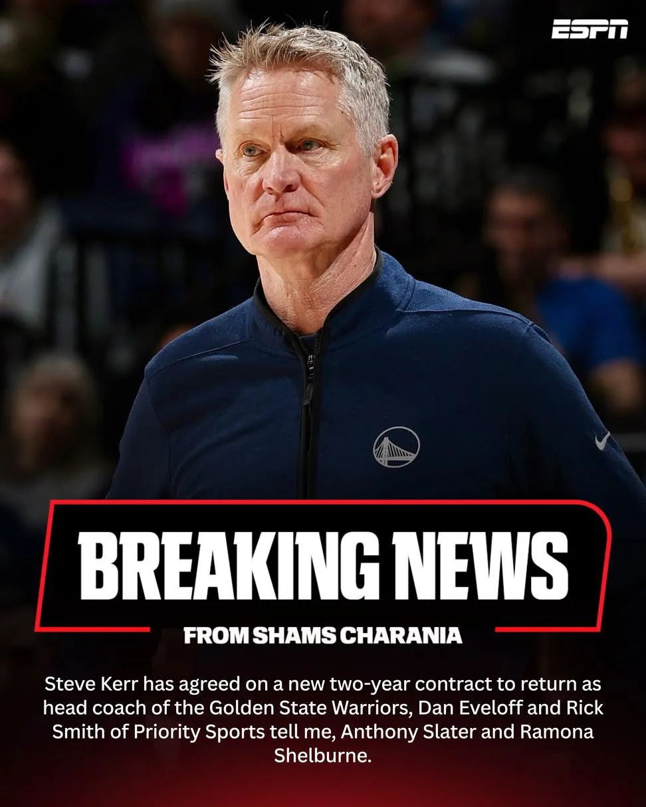

# Threads 貼文 DYI4ICTE6Eg

- 帳號: [@drchenghao](https://www.threads.com/@drchenghao)（程皓醫師｜好動人生。 運動與家庭醫學，已認證）
- 貼文 URL: https://www.threads.com/@drchenghao/post/DYI4ICTE6Eg
- 發文時間: 2026-05-10T08:52:31+08:00（UTC+8，時間戳 1778374351）
- 類型: photo
- 愛心數: 100
- 回覆數: 13
- 轉發數: 1
- 引用數: 0

## 貼文文字

Kerr 回歸勇士！！
雖然柯學家被罵爛，
不過還是樂見他與 Curry一起退休，
一起把這段 Curry 時代做一個 ending

## 圖片

- 原始圖片 URL: https://scontent-sin6-3.cdninstagram.com/v/t51.82787-15/691273757_17950482537446758_5400330390608814260_n.webp?efg=eyJ2ZW5jb2RlX3RhZyI6InRocmVhZHMuRkVFRC5pbWFnZV91cmxnZW4uOTcyLnNkci5yZWd1bGFyX3Bob3RvLmMyIn0&_nc_ht=scontent-sin6-3.cdninstagram.com&_nc_cat=110&_nc_oc=Q6cZ2gGtzeooKNU8qEa8yVEw5ElVL9D32tauf7IHHIQSq07jdWl-7FG8Q_4I4hG_qXUZwHj6b2d9e3_SKUjLiC14fkoI&_nc_ohc=uZLD0h5RWAgQ7kNvwElCPnu&_nc_gid=hl55HmGLl-ZthrKQTmaNgQ&edm=APs17CUBAAAA&ccb=7-5&ig_cache_key=Mzg5MzYwODcyMDY4OTc2NjY4OA%3D%3D.3-ccb7-5&oh=00_AQJTzna30xH6J8cmAqb8xibVerEr8JJGCPi8rQsfoezXwQ&oe=6AA5DBF6&_nc_sid=10d13b
- 尺寸: 972x1215
