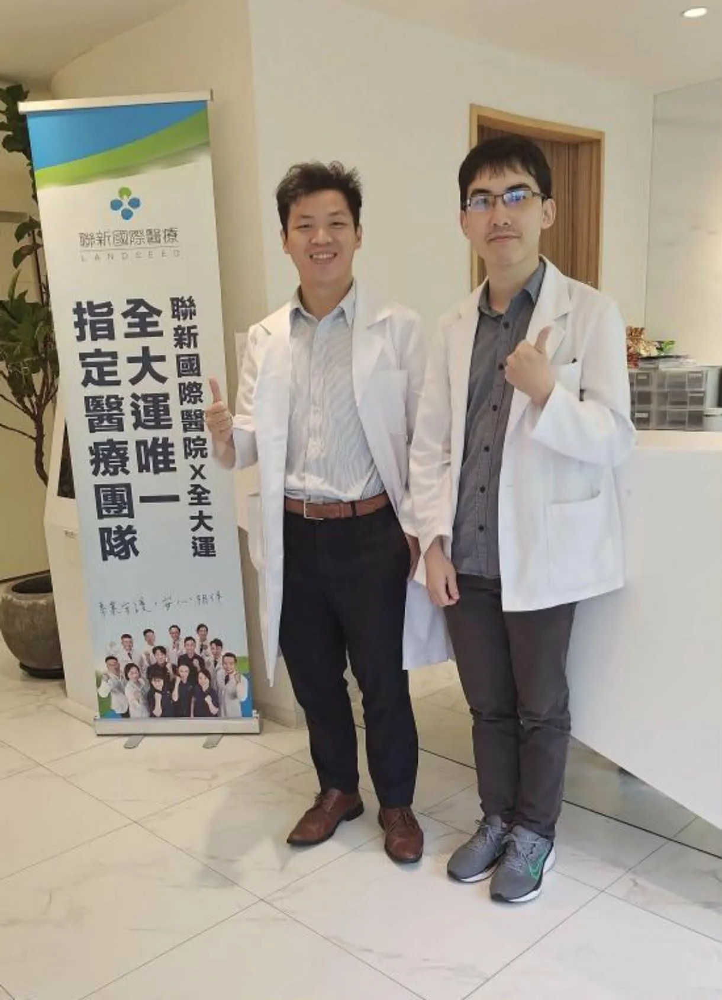

# Threads 貼文 DYPELE-k3sJ

- 帳號: [@drchenghao](https://www.threads.com/@drchenghao)（程皓醫師｜好動人生。 運動與家庭醫學，已認證）
- 貼文 URL: https://www.threads.com/@drchenghao/post/DYPELE-k3sJ
- 發文時間: 2026-05-12T18:33:14+08:00（UTC+8，時間戳 1778581994）
- 類型: photo
- 愛心數: 68
- 回覆數: 4
- 轉發數: 1
- 引用數: 0

## 貼文文字

台大住院醫師慕名而來跟診！

最近我的門診也開始有許多學弟來跟診學習，主要來了解如何將運動醫學與體重控制治療做結合，期待能夠分享運動醫學、減重知識給他們，讓他們收穫滿滿😊

## 圖片

- 原始圖片 URL: https://scontent-sin6-3.cdninstagram.com/v/t51.82787-15/691430330_17951484615446758_1821549869936465566_n.webp?efg=eyJ2ZW5jb2RlX3RhZyI6InRocmVhZHMuRkVFRC5pbWFnZV91cmxnZW4uMTIyMC5zZHIucmVndWxhcl9waG90by5jMiJ9&_nc_ht=scontent-sin6-3.cdninstagram.com&_nc_cat=110&_nc_oc=Q6cZ2gGtzeooKNU8qEa8yVEw5ElVL9D32tauf7IHHIQSq07jdWl-7FG8Q_4I4hG_qXUZwHj6b2d9e3_SKUjLiC14fkoI&_nc_ohc=fh4E1sxFQHwQ7kNvwELHVlK&_nc_gid=hl55HmGLl-ZthrKQTmaNgQ&edm=APs17CUBAAAA&ccb=7-5&ig_cache_key=Mzg5NTM1MDU1NjE0Mzg3Njg3Mw%3D%3D.3-ccb7-5&oh=00_AQK00VTwFBkMQJyvY2OiQWBmCbSY9nVyvFm3vziK2MN5yw&oe=6AA5F5CA&_nc_sid=10d13b
- 尺寸: 1220x1688
