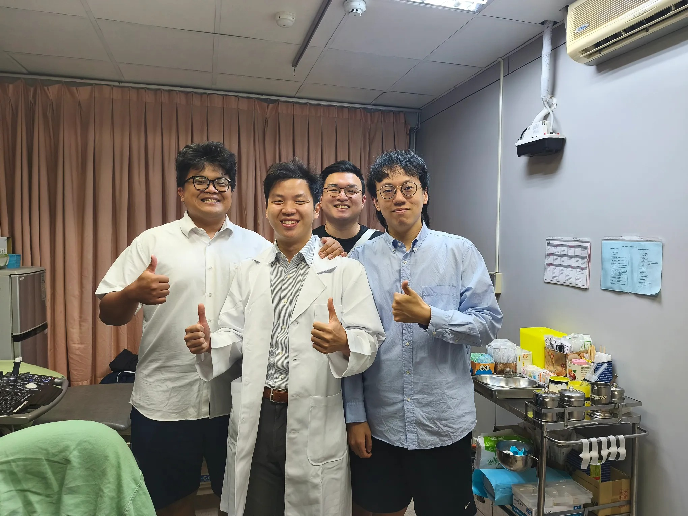

# Threads 貼文 DZCshx5kzD-

- 帳號: [@drchenghao](https://www.threads.com/@drchenghao)（程皓醫師｜好動人生。 運動與家庭醫學，已認證）
- 貼文 URL: https://www.threads.com/@drchenghao/post/DZCshx5kzD-
- 發文時間: 2026-06-01T19:47:07+08:00（UTC+8，時間戳 1780314427）
- 類型: photo
- 愛心數: 69
- 回覆數: 3
- 轉發數: 0
- 引用數: 0

## 貼文文字

老球友們竟然不約而同來看診保養，笑死
三個球友，只能湊出幾個殘破的半月板，
增生修復治療做好做滿

希望大家好好練肌力、保養膝蓋，
才能一直快樂打下去唷！

## 圖片

- 原始圖片 URL: https://scontent-sin6-3.cdninstagram.com/v/t51.82787-15/712409967_17963391384446758_1893932095980924862_n.webp?efg=eyJ2ZW5jb2RlX3RhZyI6InRocmVhZHMuRkVFRC5pbWFnZV91cmxnZW4uMjA0MC5zZHIucmVndWxhcl9waG90by5jMiJ9&_nc_ht=scontent-sin6-3.cdninstagram.com&_nc_cat=110&_nc_oc=Q6cZ2gHrAkVz9CXpqU7Vl1Q1IuEG2n65LXUTNeraw186lKsXwfmBm3ccKSeISPLCQMfVJupCFvv6bC5fqlD2ctTx-ezi&_nc_ohc=l3F0uiestlsQ7kNvwHID_OV&_nc_gid=3ofzm9g6P4z7cnQeBLTdgg&edm=APs17CUBAAAA&ccb=7-5&ig_cache_key=MzkwOTg4MzI2MTg3OTUyOTcyNg%3D%3D.3-ccb7-5&oh=00_AQK3GJQ9QcSypL95MM0E3L4jU2_f28O1Nt97JFmXSQyjCw&oe=6AA5D645&_nc_sid=10d13b
- 尺寸: 2040x1530
