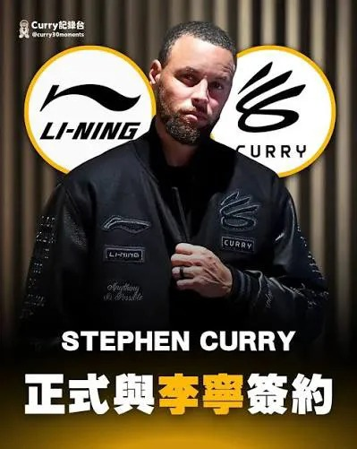

# Threads 貼文 DZEDdPoE6aF

- 帳號: [@drchenghao](https://www.threads.com/@drchenghao)（程皓醫師｜好動人生。 運動與家庭醫學，已認證）
- 貼文 URL: https://www.threads.com/@drchenghao/post/DZEDdPoE6aF
- 發文時間: 2026-06-02T08:26:43+08:00（UTC+8，時間戳 1780360003）
- 類型: photo
- 愛心數: 60
- 回覆數: 14
- 轉發數: 0
- 引用數: 2

## 貼文文字

Stephen Curry 與中國運動品牌，李寧
簽下一份為期10年的歷史性代言合約，
並將其個人品牌「Curry Brand」納入李寧的全球運動版圖之一！

Curry 在中國的熱度超級可怕
只期待能繼續推出好看的球鞋，
有機會也讓 Curry 多在亞洲區活動嘿，
小弟就近去支持 🙏

## 圖片

- 原始圖片 URL: https://scontent-sin6-3.cdninstagram.com/v/t51.82787-15/711169207_17963716047446758_6689286489982401218_n.webp?efg=eyJ2ZW5jb2RlX3RhZyI6InRocmVhZHMuRkVFRC5pbWFnZV91cmxnZW4uMzk5LnNkci5yZWd1bGFyX3Bob3RvLmMyIn0&_nc_ht=scontent-sin6-3.cdninstagram.com&_nc_cat=110&_nc_oc=Q6cZ2gG9Ish6wjV013QxQnuqdljBZQhXPuL8eR7GeDgVa-aKCzP2XdKlOSysvAn399ZoerSMY4nHAzt8pWJ7RM64RXhO&_nc_ohc=nYN6Qa8RfJAQ7kNvwH1Kdwm&_nc_gid=ALQd2glnVd41-8vLxkfTkQ&edm=APs17CUBAAAA&ccb=7-5&ig_cache_key=MzkxMDI2NTU4MDI0NzI5NTYyMQ%3D%3D.3-ccb7-5&oh=00_AQJlr76K0XOqEtWTf73mVIppKQWku57Pue6fH9-naJgWJQ&oe=6AA5D1D9&_nc_sid=10d13b
- 尺寸: 399x501
