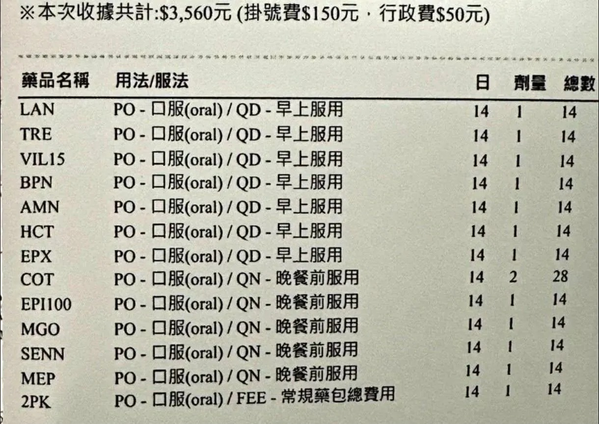

# Threads 貼文 DZGhGmek2ng

- 帳號: [@drchenghao](https://www.threads.com/@drchenghao)（程皓醫師｜好動人生。 運動與家庭醫學，已認證）
- 貼文 URL: https://www.threads.com/@drchenghao/post/DZGhGmek2ng
- 發文時間: 2026-06-03T07:24:15+08:00（UTC+8，時間戳 1780442655）
- 類型: photo
- 愛心數: 2841
- 回覆數: 281
- 轉發數: 118
- 引用數: 10
- 備註: 貼文曾被編輯

## 貼文文字

一整包的減肥藥，拜託不要用

沒想到都2026年6月，
猛健樂已經一年了，還有這種處方，
雖然已經是第三次發相關文章，
但還是必須重複強調，

雞尾酒療法，
含利尿劑、軟便藥、甲狀腺素、精神科藥，
幫你脫水、軟便、強迫代謝等等，
用完你體重一定輕，但少的是水份和便，
還有人甚至因此住院，你願意嗎？

## 圖片

- 原始圖片 URL: https://scontent-sin6-3.cdninstagram.com/v/t51.82787-15/713443445_17964173181446758_3130530304684158074_n.webp?efg=eyJ2ZW5jb2RlX3RhZyI6InRocmVhZHMuRkVFRC5pbWFnZV91cmxnZW4uMTIyMC5zZHIucmVndWxhcl9waG90by5jMiJ9&_nc_ht=scontent-sin6-3.cdninstagram.com&_nc_cat=110&_nc_oc=Q6cZ2gG9Ish6wjV013QxQnuqdljBZQhXPuL8eR7GeDgVa-aKCzP2XdKlOSysvAn399ZoerSMY4nHAzt8pWJ7RM64RXhO&_nc_ohc=m3KkwPt9g28Q7kNvwEos3rt&_nc_gid=ALQd2glnVd41-8vLxkfTkQ&edm=APs17CUBAAAA&ccb=7-5&ig_cache_key=MzkxMDk1ODkxNTU4NDc0ODAwMA%3D%3D.3-ccb7-5&oh=00_AQJ_d-g5ZDeAIwxvg97VmsxHfuW76oOPeBitomEmw2ox6A&oe=6AA5E295&_nc_sid=10d13b
- 尺寸: 1220x865
