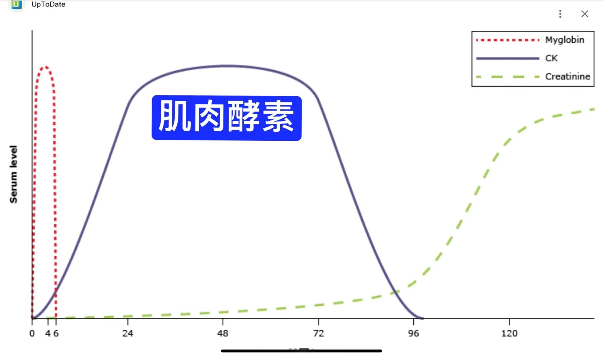

# Threads 貼文 DZhfNPbk0Qf

- 帳號: [@drchenghao](https://www.threads.com/@drchenghao)（程皓醫師｜好動人生。 運動與家庭醫學，已認證）
- 貼文 URL: https://www.threads.com/@drchenghao/post/DZhfNPbk0Qf
- 發文時間: 2026-06-13T18:47:11+08:00（UTC+8，時間戳 1781347631）
- 類型: photo
- 愛心數: 24
- 回覆數: 0
- 轉發數: 0
- 引用數: 0
- 備註: 此貼文為作者回覆自己的續文（self-thread），屬於同時發布的貼文群組 [DZhfM3tk6cV](https://www.threads.com/@drchenghao/post/DZhfM3tk6cV)

## 貼文文字

高強度運動後，肌肉會出現損傷，肌肉酵素升高是完全正常的生理反應，會形成一個自然曲線，三四天後才會降至正常水平，這是肌肉在「先破壞、再生長」的修復過程中自然產生的現象，對往後的運動也完全沒有影響 💪

但如果運動後發現尿液顏色變得很深、像可樂一樣，加上持續的肌肉腫脹疼痛，那就要盡快大量飲水，並且準備就醫了，因為這時可能是橫紋肌溶解症唷！

而補水可是一門學問！
運動後不建議一口氣猛灌大量的水，這樣反而容易造成腸胃不適，建議先小口補充，等心跳逐漸恢復正常後，再慢慢分次補充水分 🚰

另外記得同時補充電解質喔！出汗會流失鈉、鉀、鎂等礦物質，淡鹽水或運動飲料都是不錯的選擇唷~

祝各位朋友運動順利 😊

## 圖片

- 原始圖片 URL: https://scontent-sin6-3.cdninstagram.com/v/t51.82787-15/723172609_17969205942446758_6371441610981503042_n.webp?efg=eyJ2ZW5jb2RlX3RhZyI6InRocmVhZHMuRkVFRC5pbWFnZV91cmxnZW4uMjA0OC5zZHIucmVndWxhcl9waG90by5jMiJ9&_nc_ht=scontent-sin6-3.cdninstagram.com&_nc_cat=110&_nc_oc=Q6cZ2gFXIU4b43IqXjUE6lozgfdncXx27HhSGSAlo8l_lEdE0B71cQWcXctQDDvioZFWdxoxhazRO7FYrIkeKS0uLc3m&_nc_ohc=2XFH36bS23wQ7kNvwEi8RmM&_nc_gid=R4KHf9BlKavBXyz6sGD3dw&edm=APs17CUBAAAA&ccb=7-5&ig_cache_key=MzkxODU1MDQwMDE1Mjg0NzM5MQ%3D%3D.3-ccb7-5&oh=00_AQLbPCsom-OSn_LhOytZO5vj6B5vWY5T_fUfd-xyBsgX0w&oe=6AA5FB91&_nc_sid=10d13b
- 尺寸: 2048x1209
