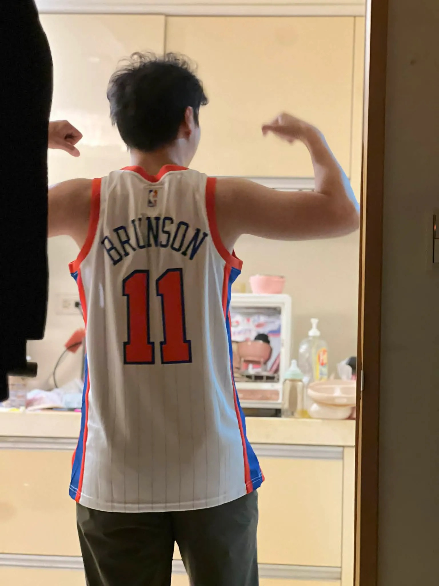

# Threads 貼文 DZjR6w9E218

- 帳號: [@drchenghao](https://www.threads.com/@drchenghao)（程皓醫師｜好動人生。 運動與家庭醫學，已認證）
- 貼文 URL: https://www.threads.com/@drchenghao/post/DZjR6w9E218
- 發文時間: 2026-06-14T11:29:32+08:00（UTC+8，時間戳 1781407772）
- 類型: photo
- 愛心數: 74
- 回覆數: 12
- 轉發數: 0
- 引用數: 0

## 貼文文字

克服萬難，尼克總冠軍！！！🔥🔥🔥

最愛的兩位球員 Brunson、Curry 他們都謙虛、低調但充滿不服輸、underdog 的求勝意志

從2022年，獨行俠與勇士的季後賽開始關注他，看到他能夠拿下冠軍、成為紐約之王，有點說不出的感動 🥹

謝謝尼克，Brunson is my doctor 🔥

## 圖片

- 原始圖片 URL: https://scontent-sin6-3.cdninstagram.com/v/t51.82787-15/721995714_17969672625446758_5667118089452465741_n.webp?efg=eyJ2ZW5jb2RlX3RhZyI6InRocmVhZHMuRkVFRC5pbWFnZV91cmxnZW4uMTUzNi5zZHIucmVndWxhcl9waG90by5jMiJ9&_nc_ht=scontent-sin6-3.cdninstagram.com&_nc_cat=110&_nc_oc=Q6cZ2gFXIU4b43IqXjUE6lozgfdncXx27HhSGSAlo8l_lEdE0B71cQWcXctQDDvioZFWdxoxhazRO7FYrIkeKS0uLc3m&_nc_ohc=9jKHAI5OdGYQ7kNvwFqrU1o&_nc_gid=R4KHf9BlKavBXyz6sGD3dw&edm=APs17CUBAAAA&ccb=7-5&ig_cache_key=MzkxOTA1NDkwNTgyNzA5Mzg4NA%3D%3D.3-ccb7-5&oh=00_AQJuzwngcNoBaplfo3BbkJKI2qpRyblf3mwMP-EXX5Dr_g&oe=6AA5F60C&_nc_sid=10d13b
- 尺寸: 1536x2048
