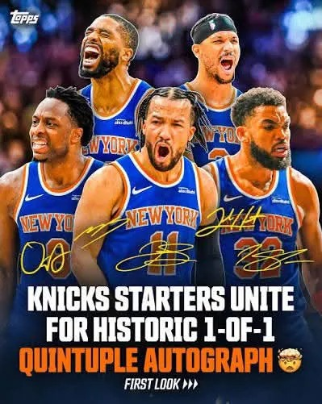

# Threads 貼文 DZpDBA2k4KZ

- 帳號: [@drchenghao](https://www.threads.com/@drchenghao)（程皓醫師｜好動人生。 運動與家庭醫學，已認證）
- 貼文 URL: https://www.threads.com/@drchenghao/post/DZpDBA2k4KZ
- 發文時間: 2026-06-16T17:14:46+08:00（UTC+8，時間戳 1781601286）
- 類型: photo
- 愛心數: 366
- 回覆數: 22
- 轉發數: 0
- 引用數: 0
- 備註: 貼文曾被編輯

## 貼文文字

你真的很難不喜歡尼克隊。

先發這五位有三人就是大學好隊友，再加上兩個有趣的大男孩，整支球隊的化學效應根本不像是靠交易和選秀拼湊出來的，更像是一群從小一起長大的兄弟。

場上的默契、場下的嬉鬧，都讓人覺得他們打球真的是在享受這件事。看到他們你會回想起國高中打球的時光。

最近的訪談和直播也都充滿笑點。
OG 節目放空發呆、Hart 說自己以前是惡霸後來和 Bridges 和好、Brunson 和 Hart鬥嘴、KAT 完美救場發言。
鏡頭一轉過去，不是有人在整隊友，就是有人說了什麼讓全場爆笑的話。

你很難想像這群人在休息室是什麼樣子，但可以確定的是，那裡每天都不會安靜。

這年頭職業球隊裡，這種氛圍其實很難得，至少在奪冠的這一刻，沒有薪水、合約、交易謠言...，這一刻就是最美好的時刻，期待明年他們的表現 😊

## 圖片

- 原始圖片 URL: https://scontent-sin6-3.cdninstagram.com/v/t51.82787-15/723809514_17970746523446758_7295413560528747670_n.webp?efg=eyJ2ZW5jb2RlX3RhZyI6InRocmVhZHMuRkVFRC5pbWFnZV91cmxnZW4uMzk5LnNkci5yZWd1bGFyX3Bob3RvLmMyIn0&_nc_ht=scontent-sin6-3.cdninstagram.com&_nc_cat=110&_nc_oc=Q6cZ2gFXIU4b43IqXjUE6lozgfdncXx27HhSGSAlo8l_lEdE0B71cQWcXctQDDvioZFWdxoxhazRO7FYrIkeKS0uLc3m&_nc_ohc=G0o-0o4PhP8Q7kNvwEAFEe_&_nc_gid=R4KHf9BlKavBXyz6sGD3dw&edm=APs17CUBAAAA&ccb=7-5&ig_cache_key=MzkyMDY3ODIxNDM3NzM3NDM2MQ%3D%3D.3-ccb7-5&oh=00_AQI3f_O6RMambEL9xM97QaRDzFHi8oyqY0PsMdqyQ1gTKg&oe=6AA5D272&_nc_sid=10d13b
- 尺寸: 399x501
