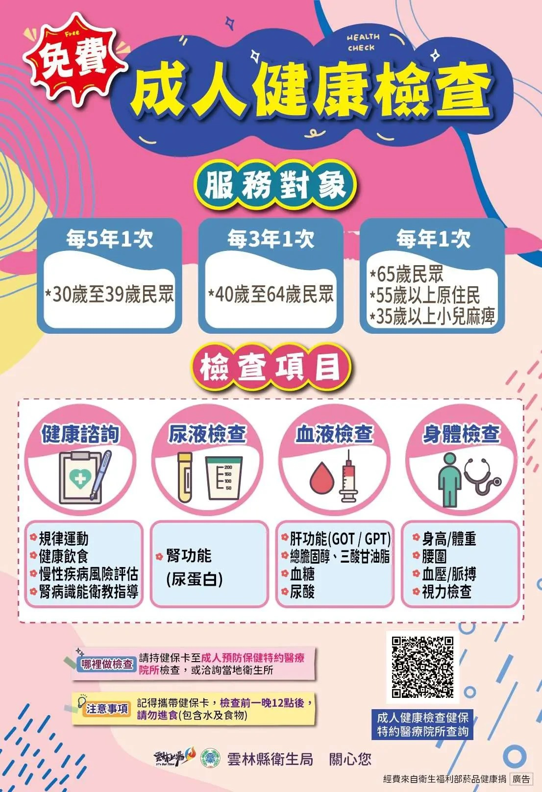

# Threads 貼文 DZuT1IKk1jv

- 帳號: [@drchenghao](https://www.threads.com/@drchenghao)（程皓醫師｜好動人生。 運動與家庭醫學，已認證）
- 貼文 URL: https://www.threads.com/@drchenghao/post/DZuT1IKk1jv
- 發文時間: 2026-06-18T18:17:53+08:00（UTC+8，時間戳 1781777873）
- 類型: photo
- 愛心數: 17
- 回覆數: 0
- 轉發數: 0
- 引用數: 0
- 備註: 此貼文為作者回覆自己的續文（self-thread），屬於同時發布的貼文群組 [DZuTuZtE3QR](https://www.threads.com/@drchenghao/post/DZuTuZtE3QR)

## 貼文文字

每三年就能做一次，
肝腎功能、血糖、膽固醇，這些就是最重要最基本的

## 圖片

- 原始圖片 URL: https://scontent-sin6-3.cdninstagram.com/v/t51.82787-15/722703826_17971661652446758_659798168687955940_n.webp?efg=eyJ2ZW5jb2RlX3RhZyI6InRocmVhZHMuRkVFRC5pbWFnZV91cmxnZW4uMTEwNi5zZHIucmVndWxhcl9waG90by5jMiJ9&_nc_ht=scontent-sin6-3.cdninstagram.com&_nc_cat=110&_nc_oc=Q6cZ2gFXIU4b43IqXjUE6lozgfdncXx27HhSGSAlo8l_lEdE0B71cQWcXctQDDvioZFWdxoxhazRO7FYrIkeKS0uLc3m&_nc_ohc=YvMHfc6hguIQ7kNvwH_1ylR&_nc_gid=R4KHf9BlKavBXyz6sGD3dw&edm=APs17CUBAAAA&ccb=7-5&ig_cache_key=MzkyMjE1OTUzOTI2OTYyMTk5OQ%3D%3D.3-ccb7-5&oh=00_AQJ8JL-kqmqM3LlvzzavnFri6wXVIMRR7_7pQOgmQ6usSg&oe=6AA5F04A&_nc_sid=10d13b
- 尺寸: 1106x1616
