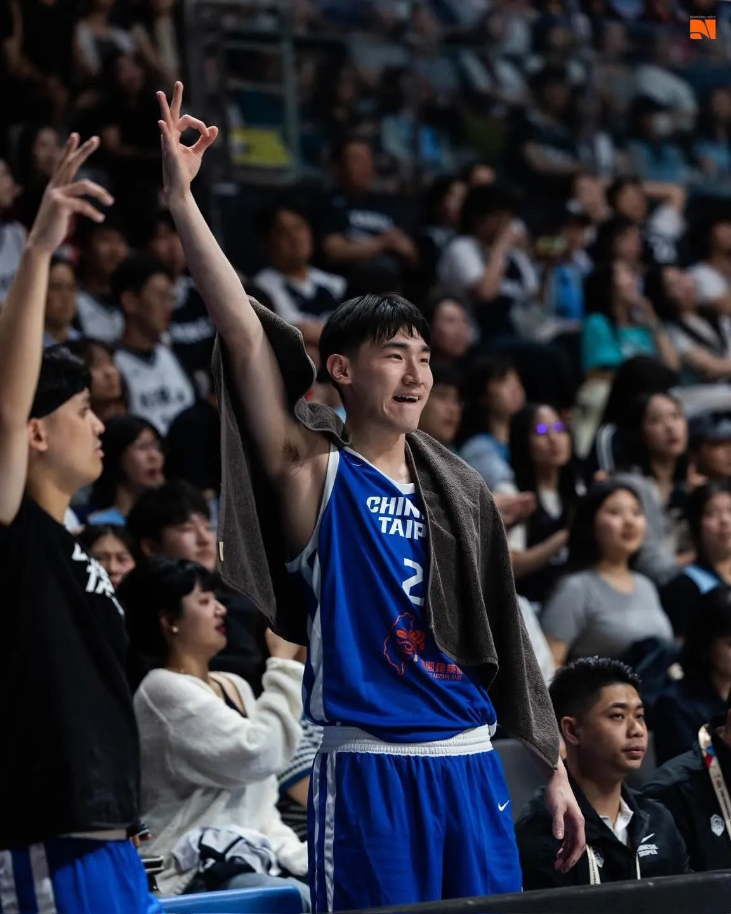

# Threads 貼文 DaVMgTfk3bW

- 帳號: [@drchenghao](https://www.threads.com/@drchenghao)（程皓醫師｜好動人生。 運動與家庭醫學，已認證）
- 貼文 URL: https://www.threads.com/@drchenghao/post/DaVMgTfk3bW
- 發文時間: 2026-07-03T20:44:16+08:00（UTC+8，時間戳 1783082656）
- 類型: photo
- 愛心數: 163
- 回覆數: 7
- 轉發數: 0
- 引用數: 0
- 備註: 貼文曾被編輯

## 貼文文字

世界杯籃球賽亞洲區資格賽
延長賽，中華 82比80，大逆轉韓國
神奇的一場比賽，讓韓國繼世界盃再度吞敗
期待後面比賽！

## 圖片

- 原始圖片 URL: https://scontent-sin6-3.cdninstagram.com/v/t51.82787-15/730320695_17979747783446758_2643138265281079932_n.webp?efg=eyJ2ZW5jb2RlX3RhZyI6InRocmVhZHMuRkVFRC5pbWFnZV91cmxnZW4uMTE1Mi5zZHIucmVndWxhcl9waG90by5jMiJ9&_nc_ht=scontent-sin6-3.cdninstagram.com&_nc_cat=110&_nc_oc=Q6cZ2gHb3ERppBVWftpjTmfXGhR9TbV6QGlrcMobuX6gbBU01gGrfc6yiRKhnmH9nibSVzf74ln4GTXEpb9xYcyHfU3J&_nc_ohc=kmwnTu8bKNUQ7kNvwFK1b8O&_nc_gid=HZa75o9O4YKfkGcozdbkcA&edm=APs17CUBAAAA&ccb=7-5&ig_cache_key=MzkzMzEwNDg0NjA5MDIzNzY1NA%3D%3D.3-ccb7-5&oh=00_AQJImR46271kpubagynypduu3zQBBDBX1UmxTWcULxO5LQ&oe=6AA60399&_nc_sid=10d13b
- 尺寸: 1152x1440
