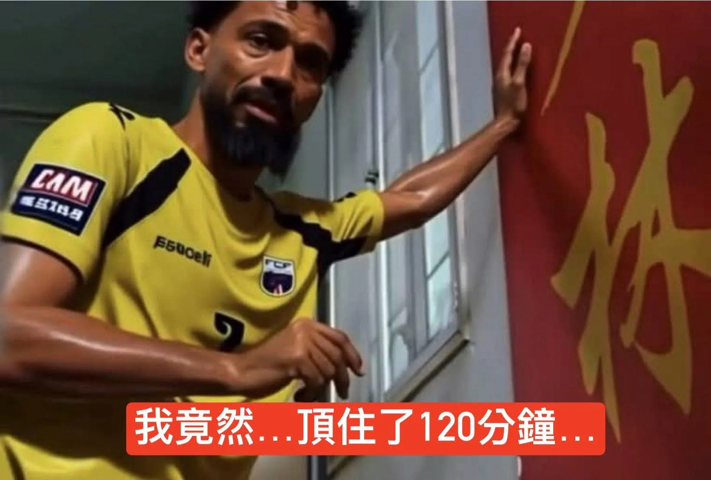

# Threads 貼文 DaWfCv2k-xa

- 帳號: [@drchenghao](https://www.threads.com/@drchenghao)（程皓醫師｜好動人生。 運動與家庭醫學，已認證）
- 貼文 URL: https://www.threads.com/@drchenghao/post/DaWfCv2k-xa
- 發文時間: 2026-07-04T08:45:29+08:00（UTC+8，時間戳 1783125929）
- 類型: photo
- 愛心數: 378
- 回覆數: 2
- 轉發數: 4
- 引用數: 2
- 備註: 貼文曾被編輯

## 貼文文字

阿根廷以一記烏龍球，
延長賽最後關頭 3：2 險勝維德角

維德角，一個人口不足60萬的島國，在世界杯的舞台上，110分鐘的時間內逼平了南美洲的霸主、前任世界盃冠軍，阿根廷。
雖然最後烏龍球結局讓人有點可惜，
但已經是場不可思議的比賽。

恭喜阿根廷晉級，
最後，維德角你已經神了！

## 圖片

- 原始圖片 URL: https://scontent-sin6-3.cdninstagram.com/v/t51.82787-15/731334752_17980054368446758_236081411583149911_n.webp?efg=eyJ2ZW5jb2RlX3RhZyI6InRocmVhZHMuRkVFRC5pbWFnZV91cmxnZW4uMTY0MC5zZHIucmVndWxhcl9waG90by5jMiJ9&_nc_ht=scontent-sin6-3.cdninstagram.com&_nc_cat=110&_nc_oc=Q6cZ2gHb3ERppBVWftpjTmfXGhR9TbV6QGlrcMobuX6gbBU01gGrfc6yiRKhnmH9nibSVzf74ln4GTXEpb9xYcyHfU3J&_nc_ohc=051sSokFnRwQ7kNvwGiXgOM&_nc_gid=HZa75o9O4YKfkGcozdbkcA&edm=APs17CUBAAAA&ccb=7-5&ig_cache_key=MzkzMzQ2Nzg1MjgxNzAzNDMzMA%3D%3D.3-ccb7-5&oh=00_AQIUaLVFC4GdsI8hNivotN1BSlTijho4xQ_SOsXMA2-oMA&oe=6AA5D49A&_nc_sid=10d13b
- 尺寸: 1640x1110
