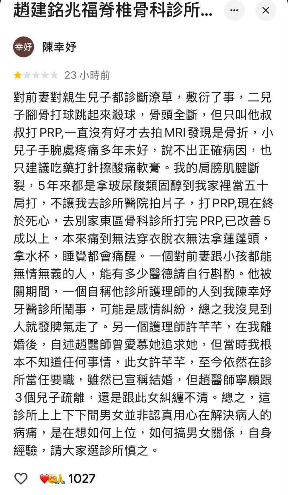

# Threads 貼文 Db942JAk33n

- 帳號: [@drchenghao](https://www.threads.com/@drchenghao)（程皓醫師｜好動人生。 運動與家庭醫學，已認證）
- 貼文 URL: https://www.threads.com/@drchenghao/post/Db942JAk33n
- 發文時間: 2026-08-13T12:32:44+08:00（UTC+8，時間戳 1786595564）
- 類型: photo
- 愛心數: 434
- 回覆數: 29
- 轉發數: 5
- 引用數: 2

## 貼文文字

昨天陳幸妤那篇真的太震撼了，各方面都是🥹
我就只評論我比較懂的部分，

做所有治療，包括 PRP
由重要程度排序
1. 診斷正確，如果治療不如預期儘速調整
2. 治療位置精準正確
3. 打的成分

如果從第一步就錯誤，打再貴都沒用

幫親友處理過各種疼痛、媽媽手、旋轉肌撕裂等，期許自己能成為家人和親友都信賴的醫師😊

## 圖片

- 原始圖片 URL: https://scontent-sin6-3.cdninstagram.com/v/t51.82787-15/771802262_17996322348446758_1853133056764558863_n.webp?efg=eyJ2ZW5jb2RlX3RhZyI6InRocmVhZHMuRkVFRC5pbWFnZV91cmxnZW4uOTc2LnNkci5yZWd1bGFyX3Bob3RvLmMyIn0&_nc_ht=scontent-sin6-3.cdninstagram.com&_nc_cat=110&_nc_oc=Q6cZ2gF2dKyDfD91Tc-TbbO_Vjy2TBoKiYQ0052MMds2CSwcSw3MD-ZCUV8Sz76GFiP3tpYYSNXVqcaIlAlGMvR22GH8&_nc_ohc=uBml7Q-w6p8Q7kNvwE1E7oT&_nc_gid=UZqkLEkPiVoLr4cioquMBQ&edm=APs17CUBAAAA&ccb=7-5&ig_cache_key=Mzk2MjU3MzI1ODI4NTYxMjUxOQ%3D%3D.3-ccb7-5&oh=00_AQIntGZGZsaWuE-CtlVSqXx7aTcy2Xf4Q80q6QVQ5HNODw&oe=6AA5FF59&_nc_sid=10d13b
- 尺寸: 976x1678
