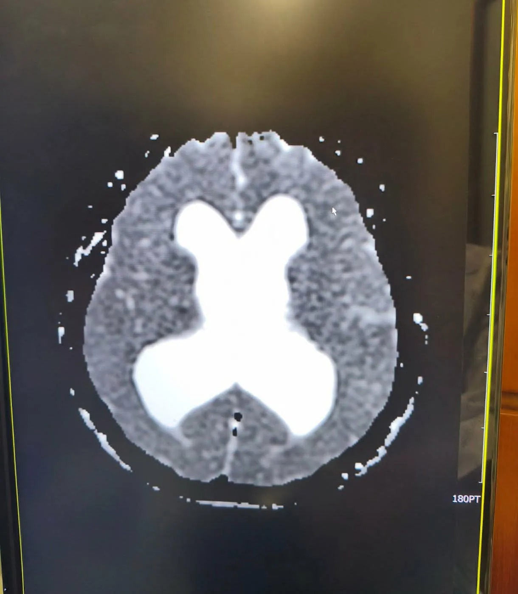

# Threads 貼文 DbShG8qE-2A

- 帳號: [@drchenghao](https://www.threads.com/@drchenghao)（程皓醫師｜好動人生。 運動與家庭醫學，已認證）
- 貼文 URL: https://www.threads.com/@drchenghao/post/DbShG8qE-2A
- 發文時間: 2026-07-27T16:17:58+08:00（UTC+8，時間戳 1785140278）
- 類型: photo
- 愛心數: 234
- 回覆數: 13
- 轉發數: 5
- 引用數: 0
- 備註: 貼文曾被編輯

## 貼文文字

打一打球眼前一片黑、頭暈、頭痛
到處看診吃藥還是有症狀，
越聽越奇怪，排了腦部核磁共振

幾天後影像出來了，結果竟然是水腦...
馬上聯絡病人，轉介神經外科
一早看到真的太可怕了 🥹

## 圖片

- 原始圖片 URL: https://scontent-sin6-3.cdninstagram.com/v/t51.82787-15/758518282_17990282526446758_4012793373993887213_n.webp?efg=eyJ2ZW5jb2RlX3RhZyI6InRocmVhZHMuRkVFRC5pbWFnZV91cmxnZW4uMTIyMC5zZHIucmVndWxhcl9waG90by5jMiJ9&_nc_ht=scontent-sin6-3.cdninstagram.com&_nc_cat=110&_nc_oc=Q6cZ2gGblU70GARlv-VZpeYKyfiXUvNuulkWCdBpN7olUs8zhZsGwACCkVb_HM63OT24OdNCu379b7Uc1iTtk1nCzTci&_nc_ohc=AA_dUN-BgakQ7kNvwF7vhlP&_nc_gid=snEKWC0rN9fv7m8Pvtaw0w&edm=APs17CUBAAAA&ccb=7-5&ig_cache_key=Mzk1MDM2NTQzNjEzOTUzMTY0OA%3D%3D.3-ccb7-5&oh=00_AQLEWp-7Vi9c4mgKB1naOfzsfPGCWXONs7GhnUP_SVg92Q&oe=6AA5E8D9&_nc_sid=10d13b
- 尺寸: 1220x1399
