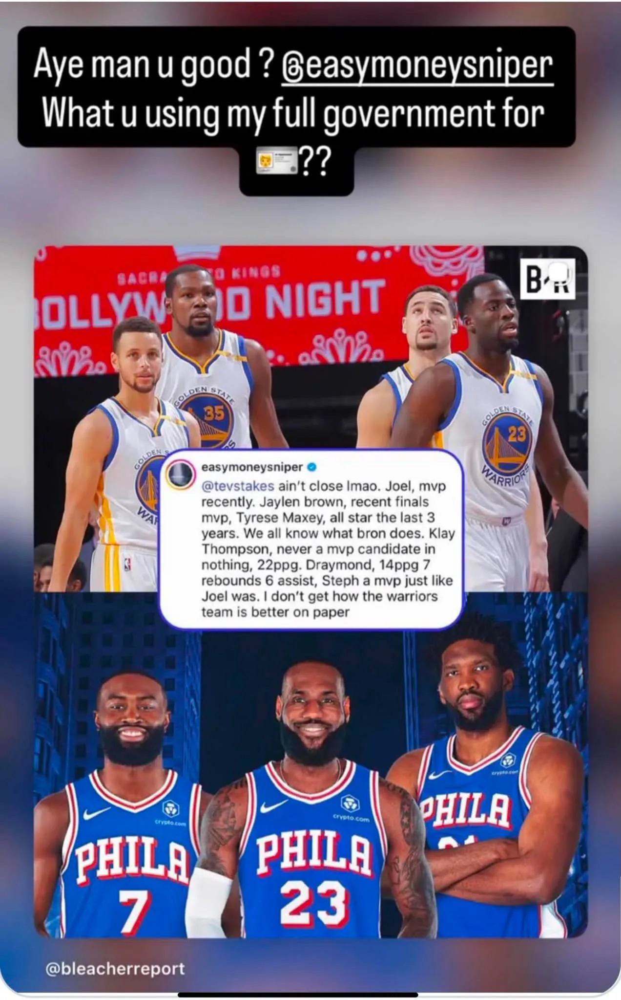

# Threads 貼文 Dbp9yY0E6O6

- 帳號: [@drchenghao](https://www.threads.com/@drchenghao)（程皓醫師｜好動人生。 運動與家庭醫學，已認證）
- 貼文 URL: https://www.threads.com/@drchenghao/post/Dbp9yY0E6O6
- 發文時間: 2026-08-05T18:51:06+08:00（UTC+8，時間戳 1785927066）
- 類型: photo
- 愛心數: 110
- 回覆數: 58
- 轉發數: 0
- 引用數: 1

## 貼文文字

KD 網路開嘴 KT、Green！這次讓人傻眼😅

給還不清楚狀況的朋友了解一下 ~

前幾天，KD 被記者訪問到，現在的七六人比較強還是當年宇宙勇比較強？

KD 回應，七六人強多了，有好幾位場均25分的選手，比當年勇士強。
如果故事到這邊就算了，想不到，他繼續在網路上發文，說 KT 場均22分、從來不是MVP候選人，Green 得分少，大開地圖砲（見下圖）

欸，不是，當年被稱作宇宙勇就是因為前一年勇士73勝還外掛你耶，76人去年甚至還不是爭冠勁旅

不過也看出 KD 一直以來的問題，總是用得分來判斷球員水平，影響他後來的組隊邏輯，也是他一直以來解決問題的方式，得分就是他的一切

唉..KD不要再網路開砲啦，把自己越描越黑真的難看了 🥹

## 圖片

- 原始圖片 URL: https://scontent-sin6-3.cdninstagram.com/v/t51.82787-15/764711380_17993652441446758_3991881001332947215_n.webp?efg=eyJ2ZW5jb2RlX3RhZyI6InRocmVhZHMuRkVFRC5pbWFnZV91cmxnZW4uMTI3Mi5zZHIucmVndWxhcl9waG90by5jMiJ9&_nc_ht=scontent-sin6-3.cdninstagram.com&_nc_cat=110&_nc_oc=Q6cZ2gGblU70GARlv-VZpeYKyfiXUvNuulkWCdBpN7olUs8zhZsGwACCkVb_HM63OT24OdNCu379b7Uc1iTtk1nCzTci&_nc_ohc=s-Cq7IBToeUQ7kNvwGzfbna&_nc_gid=snEKWC0rN9fv7m8Pvtaw0w&edm=APs17CUBAAAA&ccb=7-5&ig_cache_key=Mzk1Njk2NTQ5MTA3NjIxMTY0Mg%3D%3D.3-ccb7-5&oh=00_AQIRT1eEbvTxydPnCBL7fkp4C8nqbR4mTii_Ae7peGwKtA&oe=6AA5FEAA&_nc_sid=10d13b
- 尺寸: 1272x2046
