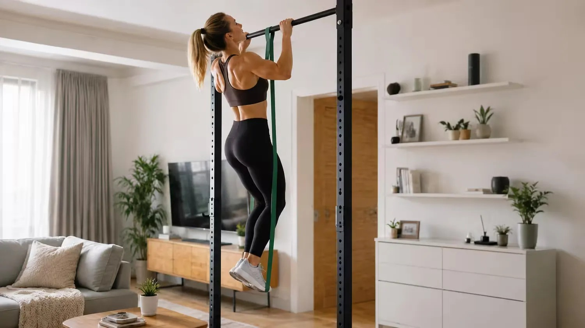

# Threads 貼文 Dc-Yp6xEwzv

- 帳號: [@drchenghao](https://www.threads.com/@drchenghao)（程皓醫師｜好動人生。 運動與家庭醫學，已認證）
- 貼文 URL: https://www.threads.com/@drchenghao/post/Dc-Yp6xEwzv
- 發文時間: 2026-09-07T13:42:05+08:00（UTC+8，時間戳 1788759725）
- 類型: photo
- 愛心數: 55
- 回覆數: 21
- 轉發數: 4
- 引用數: 1
- 備註: 貼文曾被編輯

## 貼文文字

史書華跟健人的 Cindy 挑戰比預想精彩耶 😂

最後結果，18：15 組，標準有點不一，
事實證明 39組真的太唬，不過已經很強，
且能讓大家認識這個挑戰挺不錯

自體重量訓練非常適合一般人入門，
其中引體向上真的難，
小弟完成8組已經快往生，
最大限制也是引體向上 🥹
大家有空也可以來一起練練唷 🔥
-------------------------------------
Cindy挑戰的規則為 AMRAP（As Many Rounds As Possible），也就是在 20分鐘 的限制時間內，循環完成以下三種自體重量，
計算總共能做完幾輪： 
引體向上（Pull-ups）：5次
伏地挺身（Push-ups）：10次
徒手深蹲（Squats）：15次

## 圖片

- 原始圖片 URL: https://scontent-sin6-3.cdninstagram.com/v/t51.82787-15/798393141_18006010971446758_7207563967737027175_n.webp?efg=eyJ2ZW5jb2RlX3RhZyI6InRocmVhZHMuRkVFRC5pbWFnZV91cmxnZW4uMTUwMC5zZHIucmVndWxhcl9waG90by5jMiJ9&_nc_ht=scontent-sin6-3.cdninstagram.com&_nc_cat=110&_nc_oc=Q6cZ2gFfSoPOiAPWRkDTyJcTAGx0gsc3DRIQbFSb6L67xaVZD1hcTFRv2EKSMNWvP-Rd2p5OYAk_I8cITf9aRsGNCuWk&_nc_ohc=vqJpoQj0BRIQ7kNvwFfBbuh&_nc_gid=qAbpG5jwuCoYPd8cW1UFKg&edm=APs17CUBAAAA&ccb=7-5&ig_cache_key=Mzk4MDcyNzU1NDM1NzI2NzY5NQ%3D%3D.3-ccb7-5&oh=00_AQLUTA_j1vx824nN4QramIqVYaNfgd7dmdlRsu-cQUnd0A&oe=6AA5DDF7&_nc_sid=10d13b
- 尺寸: 1500x844
