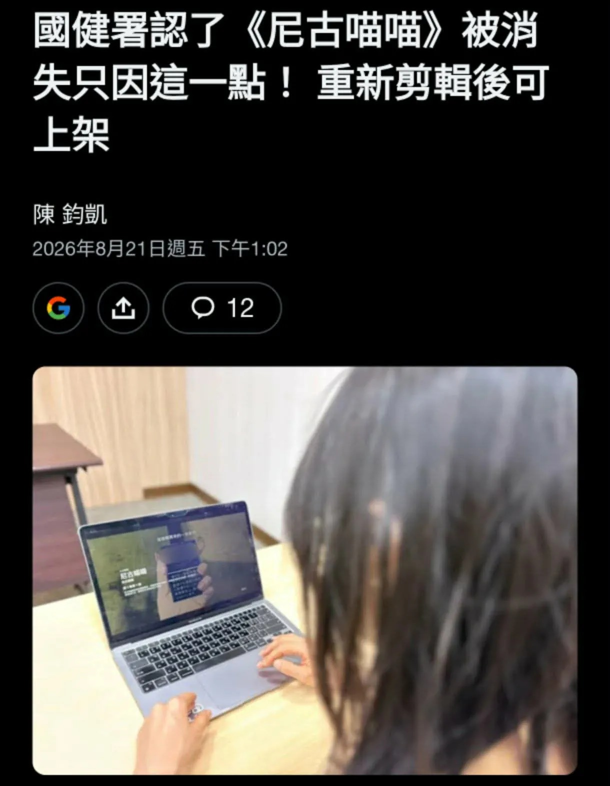

# Threads 貼文 DcS45tjEqDO

- 帳號: [@drchenghao](https://www.threads.com/@drchenghao)（程皓醫師｜好動人生。 運動與家庭醫學，已認證）
- 貼文 URL: https://www.threads.com/@drchenghao/post/DcS45tjEqDO
- 發文時間: 2026-08-21T16:17:16+08:00（UTC+8，時間戳 1787300236）
- 類型: photo
- 愛心數: 103
- 回覆數: 24
- 轉發數: 3
- 引用數: 0

## 貼文文字

動漫迷的勝利！尼古喵喵有機會重新上架 😊

這部完全讓人看到吸菸及戒斷症候群的可怕，
反菸神作該要繼續推行下去，恭喜大家 ~
-----------------------------
國健署今（21）日表示，動漫有問題內容是出現「真實菸品品牌及包裝」，涉違反菸品廣告，但業者只要依法予以屏蔽等剪輯作業，自然可以再上架。

## 圖片

- 原始圖片 URL: https://scontent-sin6-3.cdninstagram.com/v/t51.82787-15/780949515_17999740848446758_281071714205520597_n.webp?efg=eyJ2ZW5jb2RlX3RhZyI6InRocmVhZHMuRkVFRC5pbWFnZV91cmxnZW4uMTIyMC5zZHIucmVndWxhcl9waG90by5jMiJ9&_nc_ht=scontent-sin6-3.cdninstagram.com&_nc_cat=110&_nc_oc=Q6cZ2gH7orE96FjtkJyjAm000UT_2u46OotJuV3cdlpyp8VX6cWIyxxemsYIYpha5yIsL0H0AvVjLaK6oYtxS6RMdLCO&_nc_ohc=zOjIUEH_qPwQ7kNvwF8_G-s&_nc_gid=tb_epKsJAMRM-H-EF358ZA&edm=APs17CUBAAAA&ccb=7-5&ig_cache_key=Mzk2ODQ4NDQ3ODE4ODQyOTUxOA%3D%3D.3-ccb7-5&oh=00_AQLf0KCij_3uScEigFE5oOGHiAYLOsRkAXtmUeQyQS4SRQ&oe=6AA5D92A&_nc_sid=10d13b
- 尺寸: 1220x1572
