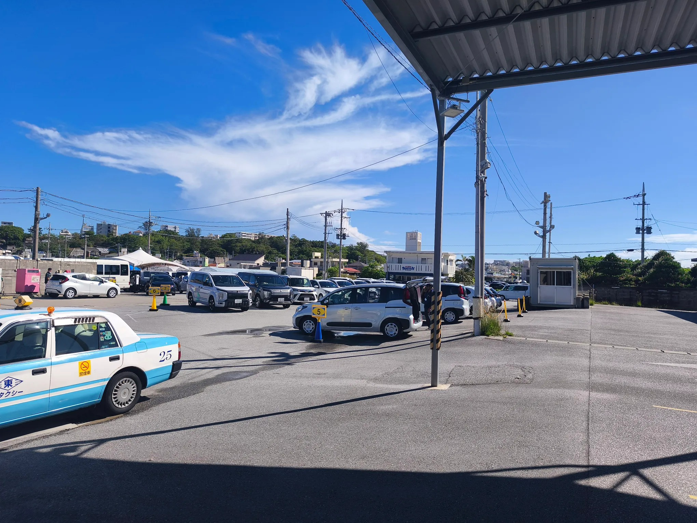

# Threads 貼文 DcXMX3ck1Vf

- 帳號: [@drchenghao](https://www.threads.com/@drchenghao)（程皓醫師｜好動人生。 運動與家庭醫學，已認證）
- 貼文 URL: https://www.threads.com/@drchenghao/post/DcXMX3ck1Vf
- 發文時間: 2026-08-23T08:24:23+08:00（UTC+8，時間戳 1787444663）
- 類型: photo
- 愛心數: 183
- 回覆數: 12
- 轉發數: 0
- 引用數: 0

## 貼文文字

想不到被多颱夾殺的沖繩，
迎來這樣的好天氣 🥹
期待後續幾天排的精彩行程！

## 圖片

- 原始圖片 URL: https://scontent-sin6-3.cdninstagram.com/v/t51.82787-15/783286225_18000277368446758_6199976827263785596_n.webp?efg=eyJ2ZW5jb2RlX3RhZyI6InRocmVhZHMuRkVFRC5pbWFnZV91cmxnZW4uMjA0MC5zZHIucmVndWxhcl9waG90by5jMiJ9&_nc_ht=scontent-sin6-3.cdninstagram.com&_nc_cat=110&_nc_oc=Q6cZ2gH7orE96FjtkJyjAm000UT_2u46OotJuV3cdlpyp8VX6cWIyxxemsYIYpha5yIsL0H0AvVjLaK6oYtxS6RMdLCO&_nc_ohc=DyLV-OcOpncQ7kNvwHr8fuS&_nc_gid=tb_epKsJAMRM-H-EF358ZA&edm=APs17CUBAAAA&ccb=7-5&ig_cache_key=Mzk2OTY5NjAxMzE5MTY5Nzc1OQ%3D%3D.3-ccb7-5&oh=00_AQIGJXFxbBGl8hQck-rqOqgUaiakTRieASWcREgyuVsiGw&oe=6AA5D7B1&_nc_sid=10d13b
- 尺寸: 2040x1530
