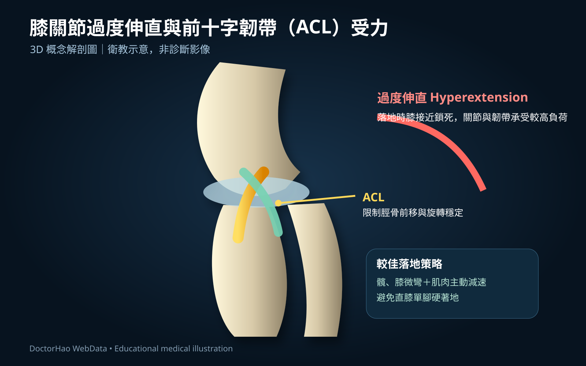

# DoctorHao 醫學 3D 解說素材

本資料夾收錄依 `website_blog/posts` 文章內容製作的可直接用於網站之 SVG 醫學衛教素材。SVG 為向量圖，可直接嵌入 HTML/Markdown，亦適合後續轉成 PNG/WebP。

> 注意：素材定位為醫學教育與衛教示意，不取代診斷影像、臨床評估或個別醫療建議。

## 素材與文章對應

| 素材 | 對應文章 | 建議插入位置 |
|---|---|---|
| `knee-acl-hyperextension-3d.svg` | `2023-04-paul-george.md` | 膝過度伸直、ACL 承重段落 |
| `landing-mechanics-3d.svg` | `2023-04-paul-george.md` | 直膝單腳落地與良好落地機制段落 |
| `sideline-abcde-3d.svg` | `2023-04-blog-post.md` | ABCDE 場邊初步評估段落 |
| `msk-ultrasound-guidance-3d.svg` | `2023-04-blog-post_30.md` | 超音波導引注射與神經血管避讓段落 |
| `gymnast-wrist-growth-plate-3d.svg` | `2023-05-blog-post.md` | 體操上肢承重、生長板與手腕傷害段落 |
| `sport-concussion-pathway-3d.svg` | `2023-05-blog-post_20.md` | Recognise / Remove / Re-evaluate / Rest 段落 |

`2023-03-blog-post.md` 與 `2023-05-112.md` 主要屬醫師介紹／賽事紀錄，原始照片比額外解剖圖更符合內容，因此本輪未強行加入醫學解剖素材。

## Markdown 使用範例

```md

```

## 設計原則

- 1600×1000，適合文章主視覺與社群裁切。
- 深色醫療視覺、立體漸層、重點色標示。
- 中文主標＋必要英文醫學名詞。
- 圖內避免宣稱單一機轉必然導致特定傷害。
- 侵入性操作與腦震盪素材加入安全提示。

## 後續可擴充

若網站前端需要 raster 格式，可在 CI 中以 SVG renderer 批次輸出 `webp`/`png`；建議保留 SVG 作為 source of truth。亦可進一步製作肩、肘、腕、髖、膝、踝各部位的超音波標準掃描姿勢系列，以及體操常見傷害的分部位圖譜。