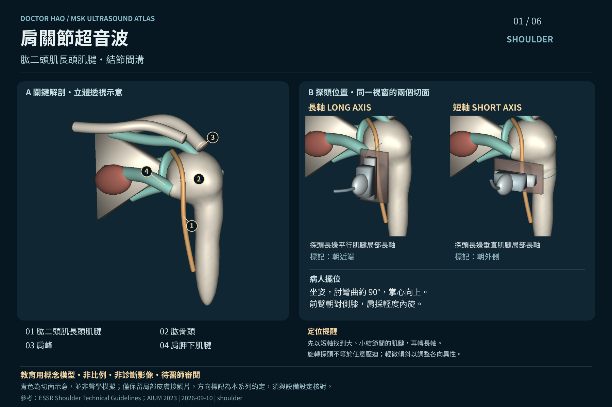
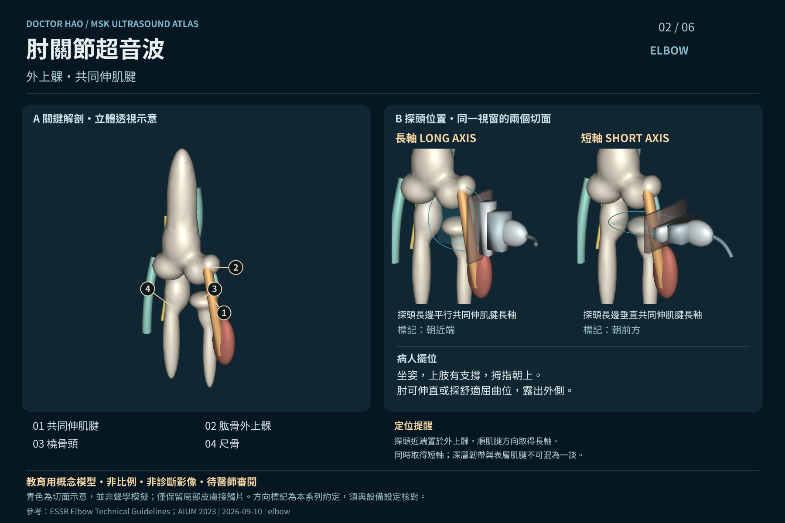
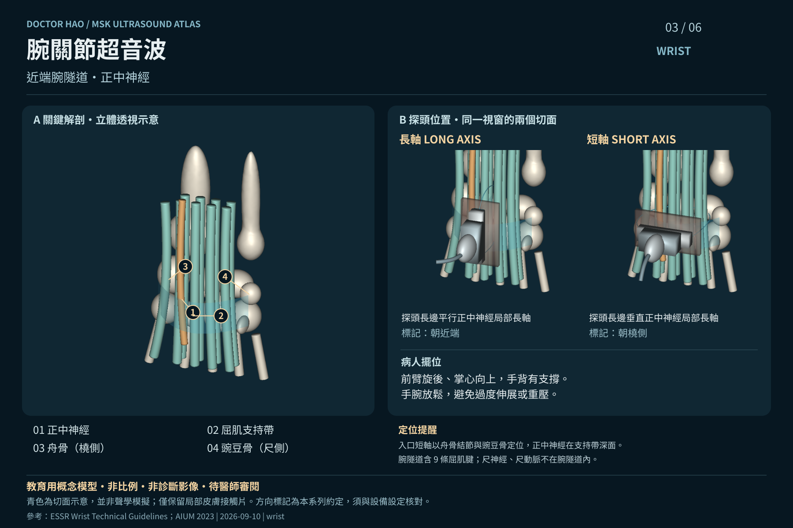
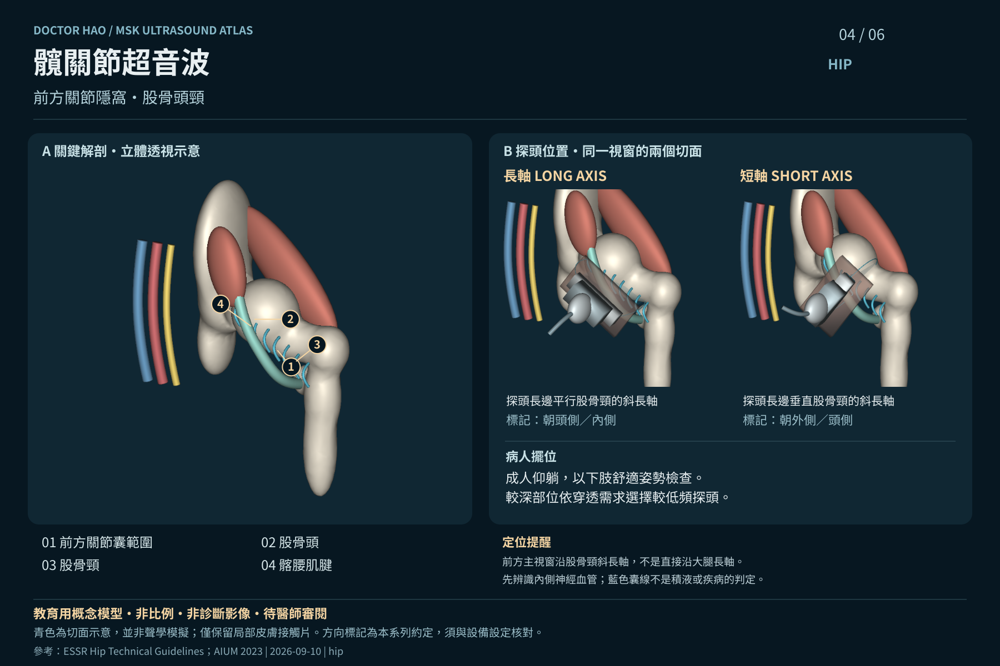
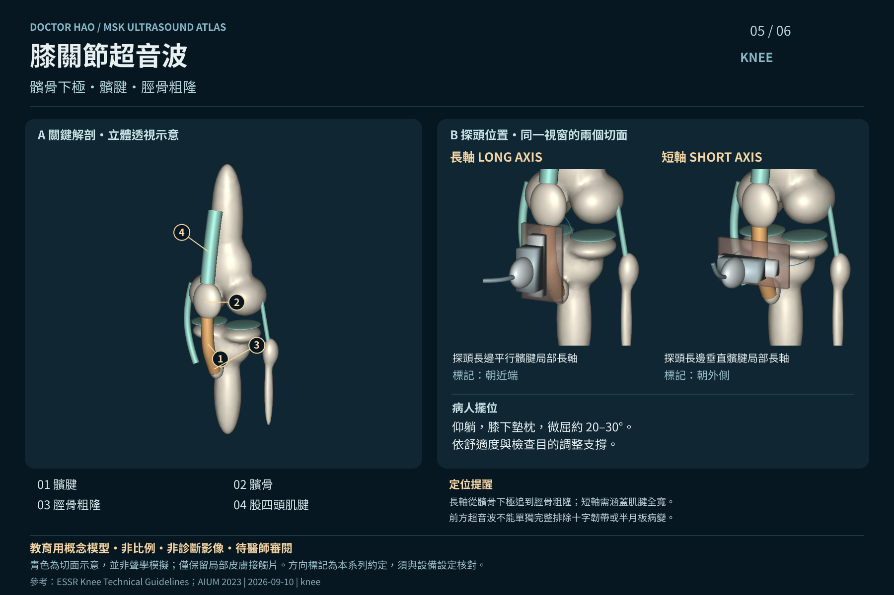
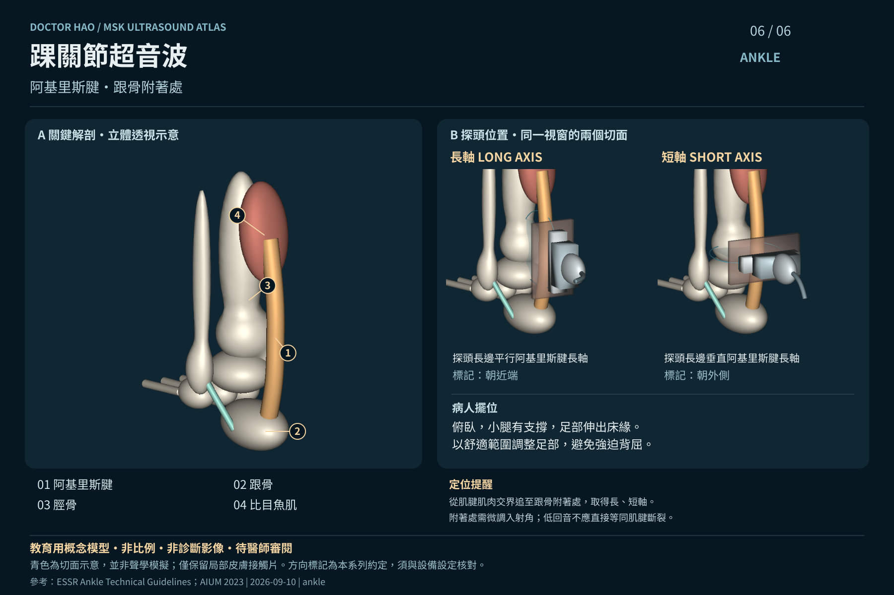

# 超音波六部位系列

AI 輔助製作的概念性教學素材，尚待程皓醫師審閱；不是患者影像、標準化完整檢查流程或操作認證。

此目錄保留六張文章用 SVG。完整 PNG / WebP、可旋轉 GLB 與來源位於 [網站素材目錄](../../../website/public/medical-visuals/ultrasound/README.md)。

SVG 圖卡內含三維模型渲染及可編輯文字，不是可旋轉 SVG；需要互動時請使用 GLB 或網站 `/ultrasound-atlas/`。

## 肩關節：肱二頭肌長頭肌腱・結節間溝

## 肘關節：外上髁・共同伸肌腱

## 腕關節：近端腕隧道・正中神經

## 髖關節：前方關節隱窩・股骨頭頸

## 膝關節：髕骨下極・髕腱・脛骨粗隆

## 踝關節：阿基里斯腱・跟骨附著處

