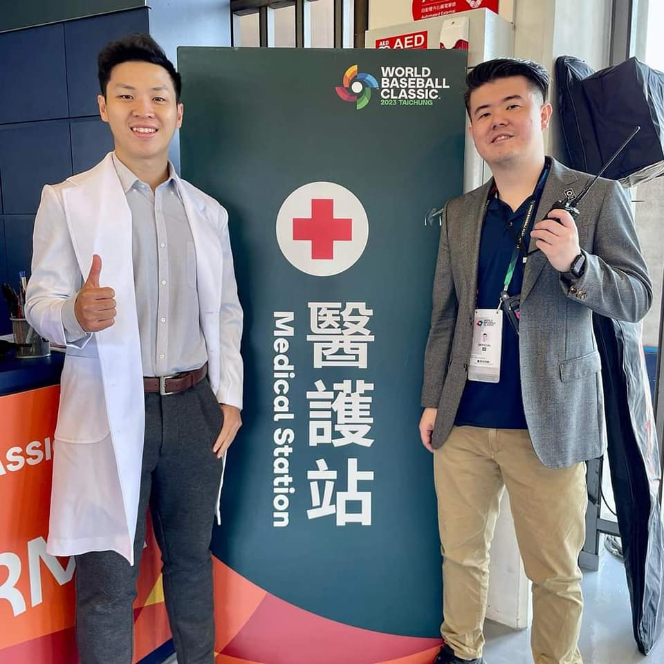
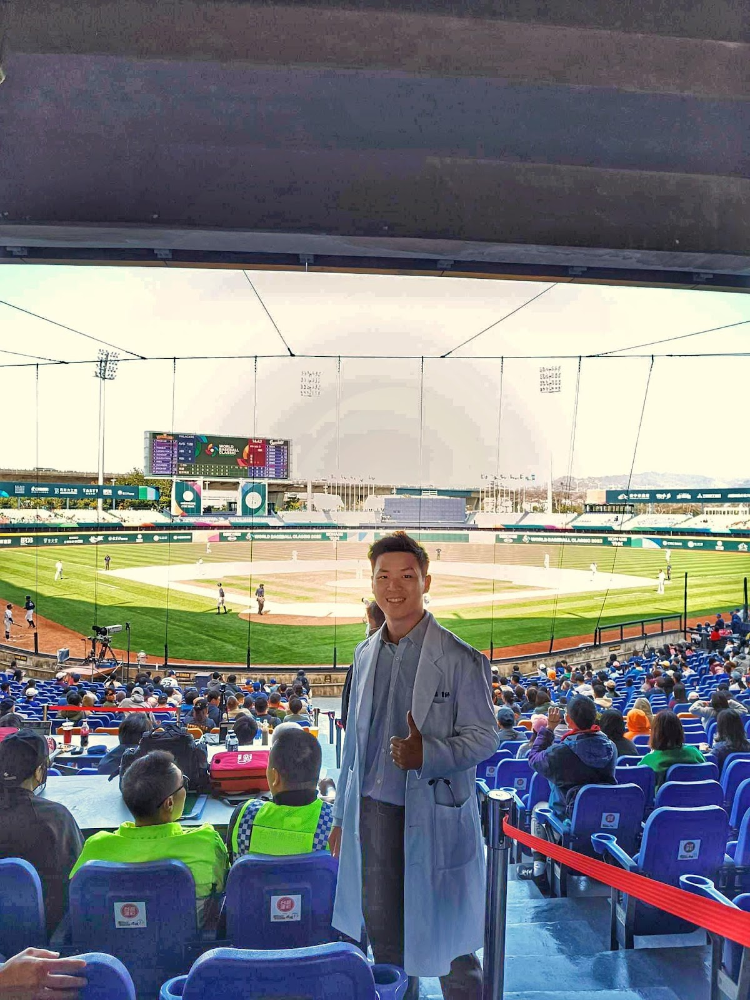
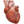
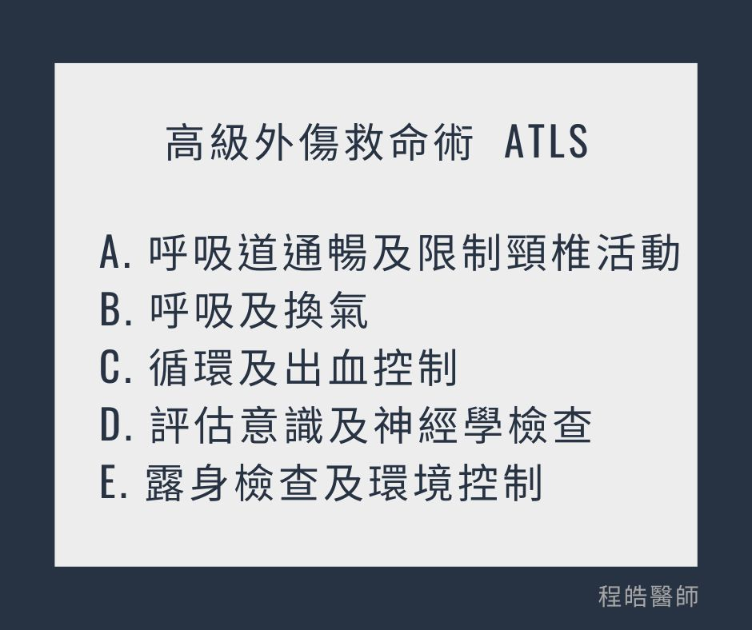

# 我也想當場邊醫師，我第一步該準備什麼?

- 發文日期：2023-04-20
- 原文 URL：https://drchenghao.blogspot.com/2023/04/blog-post.html
- 抓取時間：2026-09-08T20:50:00+08:00
- 來源：程皓醫師。好動人生 (https://drchenghao.blogspot.com/)

---

這次有幸在 [台灣運動醫學醫學會 -TASM](https://www.facebook.com/TASM2016?__cft__[0]=AZU_63MBBru_StlyUPrHALJRn9Je6M64W3E8YMTtgfZO6hzaICl7YaTQunWuZlxZoWtFuHt37A1RjrVlfnrw7mnJE_ke_17b3SNt4qK6Il0hm1mxI7FeJemDa-hqc4gHHAKUHkJ7ygmzm9vCuxHexI1WA13Rvr29Yljqs8H8Q_qcdD-ThCQ9XDYExefbKDnaB10&__tn__=-]K-R) 安排下，於2023年經典賽擔任場邊醫師，

賽前將以往上課的內容重新複習，
幸好比賽過程一帆風順，順利完賽。
今天趁著經典賽決戰前夕，
來分享場邊醫師的基礎必備知識，
當然這只是其中一部份，後續還有許許多多需要學習的!

--------------------------------------------------
對於賽場邊的傷害判定，最重要的是即刻確認病患的生命徵象及緊急程度，
ABCDE:
( Airway, Breathing, Circulation, Disability, Evaluation/extremities)
A. 呼吸道通暢及限制頸椎活動
B. 呼吸及換氣
C.循環及出血控制
D.評估意識及神經學檢查
E. 露身檢查及環境控制

若是危及生命的狀況已經處理好，應轉向評估肢體的情況。
此時需要完整的病史詢問以及理學檢查 (包括受傷機轉、有無撞擊、疼痛程度、麻木感、開放性傷口或肢體變形)

評估四肢受傷:
最初和最重要的步驟，確認神經血管功能。(包含遠端感覺、運動功能和脈搏有無異常)
可在現場進行一次受損肢體的復位(ONE on-the-field attemp)，是合理並且值得鼓勵的。

除非緊急運送到鄰近醫療院所需要較長時間，否則不應進行多次嘗試。在嘗試前後始終檢查遠端脈搏。

關於場邊處理，非緊急之骨骼關節傷害並沒有明確的回場規定。(no set return-to-play guidelines)
可根據以下規則考慮是否進行影像學檢查：渥太華踝關節規則、渥太華膝關節規則、匹茲堡膝關節規則、加拿大C頸椎規則。
(Ottawa ankle, Ottawa knee, Pittsburgh knee, Canadian C spine rules)

參考資料:
Extremity trauma: field management of sports injuries. 2014