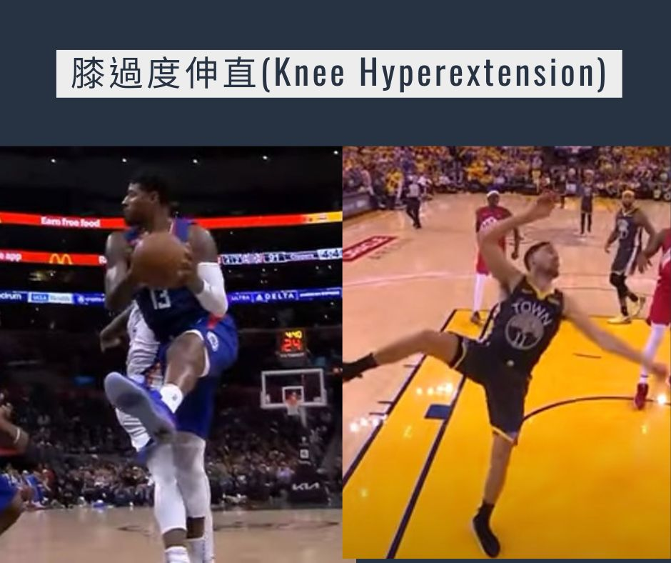
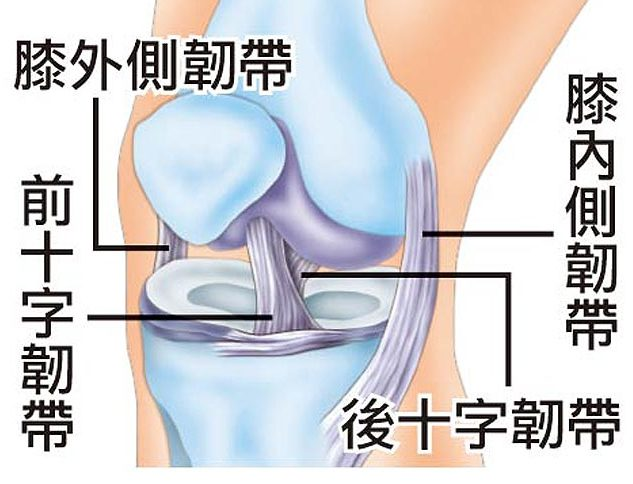

# 淺談 Paul George膝傷及落地機制的重要

- 發文日期：2023-04-10
- 原文 URL：https://drchenghao.blogspot.com/2023/04/paul-george.html
- 抓取時間：2026-09-08T20:50:00+08:00
- 來源：程皓醫師。好動人生 (https://drchenghao.blogspot.com/)

---

看到PG受傷的影片，當下心裡只有一句：完蛋了

不禁讓我想起當年K湯的大傷，幸好隔天檢查發現，PG應該只是膝蓋扭傷，真的是不幸中的大幸，為什麼會這樣說呢?

----------------------------------------------------------
[]因為從當下受傷之機轉來看，最有可能是落地時因**膝關節過度伸直(hyperextension)**。導致韌帶與關節
承受巨大的力量。

其中最主要幫助穩定膝關節的韌帶就是大名鼎鼎的前十字韌帶，
具有限制膝旋轉及膝向前位移的能力。

造成前十字韌帶最大承重的動作包含
**膝關節過度伸直** 及 **膝外翻外轉**(股骨內轉合併脛骨外轉)
而膝關節過度伸直情況時，若是同時單腳落地並且合併其他外力就可能造成巨大的傷害。

以下段落取自"運動視界: 從 Klay Thompson 這一摔論落地機制的重要性

"直膝單腳落地:

籃球員的運動傷害大多集中在下肢，當球員沒有好的落地機制時，便會對髖、膝、踝三個關節產生超過十倍體重的負荷。尤其當膝關節保持伸直的情況落地時，地板所產生的反作用力無法藉由其他組織吸收，完全依靠膝軟骨與半月板進行吸震的動作，如此一來就大幅提升了運動傷害發生的機率。

    而Rose在生涯初期就正好非常習慣使用單腳落地。最好的落地姿勢應該保持膝關節與髖關節微彎，讓股四頭肌、臀大肌及腿後肌去協助減速並吸收落地時產生的力道。"

------------------------------------------------------------------

因此好的落地機制及膝關節周圍及大腿、髖關節肌力非常重要
常見訓練動作包含:
**硬舉、深蹲、單腿硬舉、分腿蹲**等
(之後有機會介紹這幾個動作有多重要)

期待大家持續訓練，保護自己的膝關節，繼續快樂運動! 

訓練動作可參考 IRON士倫的影片
[https://www.youtube.com/watch?v=r38nFdreoVU](https://l.facebook.com/l.php?u=https%3A%2F%2Fwww.youtube.com%2Fwatch%3Fv%3Dr38nFdreoVU%26fbclid%3DIwAR1MQy77A7xZHc2ZAz6XUwsnkdOvjHylmWpsqiE1JCWkuY_Ae3cvVwMufJo&h=AT2rImbsL3Cyy7FWKzpoeacxdvX93CO5uh07FFgsGpC6f4WfvzY4biJj4tm1gaT5MnJQPCiK3M2ZeybuW3VzYSj59F8DhgKCUJZOqxl7U0cIhRixhQVRJFZQNQlSIM7pz5onYHUsCw7AkjwQl1Pk&__tn__=-UK-R&c[0]=AT10aRAYHa7J89Vi6uE3ZmnCea9I7c867gv9oQlhxZvwnmKlmnYsrqfZduDecaNq1B2B8p3OtkszKqIgkJiQZaXMJP7rG562UXsVA6pIY8lee9S1ZHXlxGrUpQ2LzUhf_qKE3MljIgS1u0hRyh1AAWRYPuoMXC7ILC6DvbKw3nx1Qb7-jPLdfQTg5daOPAdGBKWHTss2mN95)

參考資料:
運動視界: 從 Klay Thompson 這一摔論落地機制的重要性-達斯
[https://www.sportsv.net/articles/59290](https://l.facebook.com/l.php?u=https%3A%2F%2Fwww.sportsv.net%2Farticles%2F59290%3Ffbclid%3DIwAR3iiYHo_KFP_p1hJ1Livg8A5dyPB2AubqGcdGpWoldEHzwfyFwqIlrqRwo&h=AT3Tt2cwT6JX6EYrErIu0xC4kA56SE9hS-i4CbLOFv9UvDOxIKe6099FTJladTfgu482pgNvVaLig0jRdy75GAYtFENQ1T3srUjGrkhkuV-gqRpH2zvIfa8avwd0OM9Yy93CpyH2faL3nIuqugpE&__tn__=-UK-R&c[0]=AT10aRAYHa7J89Vi6uE3ZmnCea9I7c867gv9oQlhxZvwnmKlmnYsrqfZduDecaNq1B2B8p3OtkszKqIgkJiQZaXMJP7rG562UXsVA6pIY8lee9S1ZHXlxGrUpQ2LzUhf_qKE3MljIgS1u0hRyh1AAWRYPuoMXC7ILC6DvbKw3nx1Qb7-jPLdfQTg5daOPAdGBKWHTss2mN95)

字母哥的案例，天生神力
從字母哥膝傷談「過度伸展」傷後回歸可能性-劉又銓醫師

[https://running.biji.co/index.php?q=news&act=info......](https://running.biji.co/index.php?q=news&act=info&id=105829&subtitle=%E3%80%90Dr.6%20%E5%B0%88%E6%AC%84%E3%80%91%E5%BE%9E%E5%AD%97%E6%AF%8D%E5%93%A5%E8%86%9D%E5%82%B7%E8%AB%87%E3%80%8C%E9%81%8E%E5%BA%A6%E4%BC%B8%E5%B1%95%E3%80%8D%E5%82%B7%E5%BE%8C%E5%9B%9E%E6%AD%B8%E5%8F%AF%E8%83%BD%E6%80%A7PG&fbclid=IwAR3dZXtaKpALM5g1lTTqx3ez4hmFeBmxTpl0ndLtiBXS3h1h0ZXC9KdiC6k)