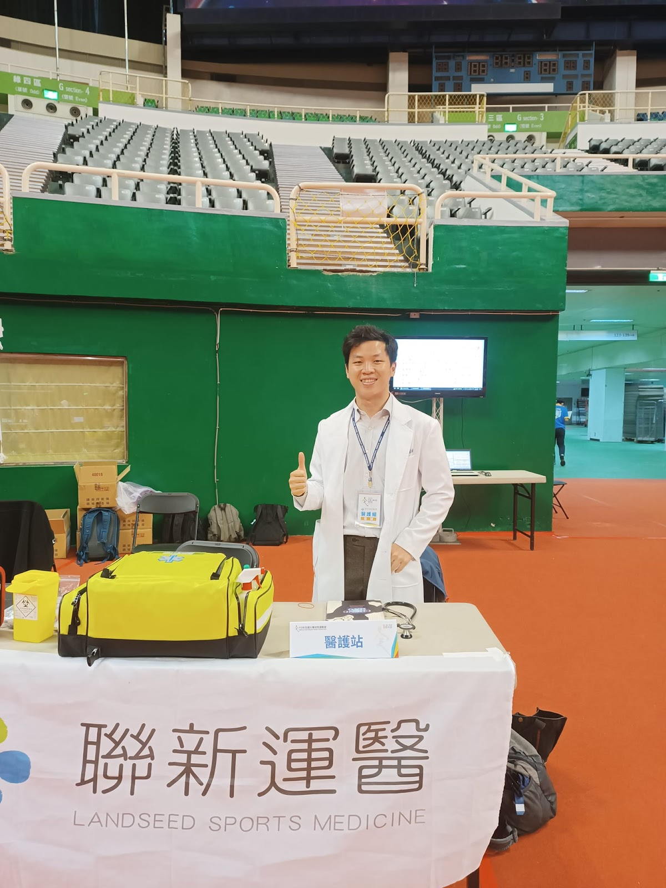
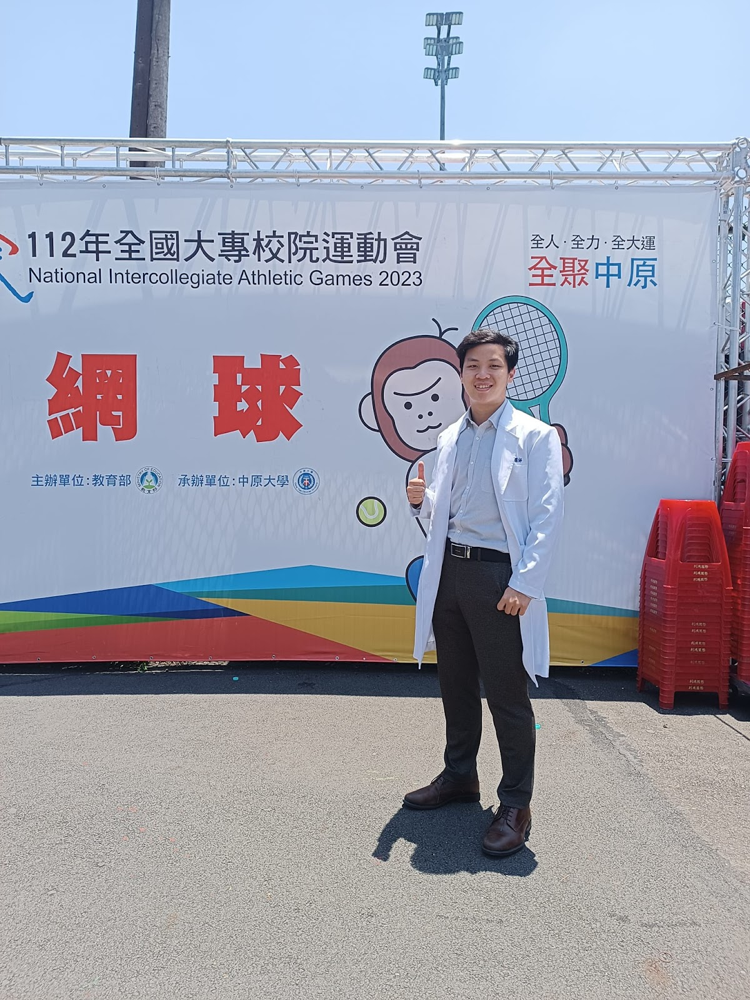

# 112年全大運場邊醫師

- 發文日期：2023-05-18
- 原文 URL：https://drchenghao.blogspot.com/2023/05/112.html
- 抓取時間：2026-09-08T20:50:00+08:00
- 來源：程皓醫師。好動人生 (https://drchenghao.blogspot.com/)

---

今年在桃園中原大學舉行，由聯新國際醫院/聯新運醫/台灣運動醫學醫學會（TASM)一起支持全大運。

  這次賽事很幸運的擔任競技體操及網球的場邊醫師，近距離觀賞高水準的比賽，在體操看到令人感動的單槓飛躍，觀賞丁華恬選手，令人驚嘆的平衡木表演，欣賞剛開始挑戰國際賽事的曹家宜選手的風采（整個變成全大運遊記？）

  []這次賽事需要於第一時間決定場上選手的動向，其實內心有些許緊張，賽前將可能發生的意外及處理都先在腦中run過一遍，幸好過程一切順利，期待未來能看到選手們繼續在國際上發光發熱，明年全大運見！

