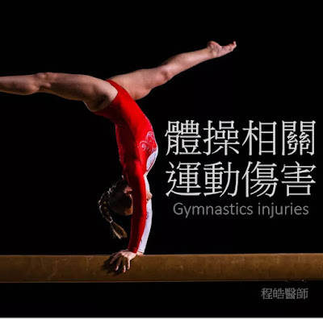
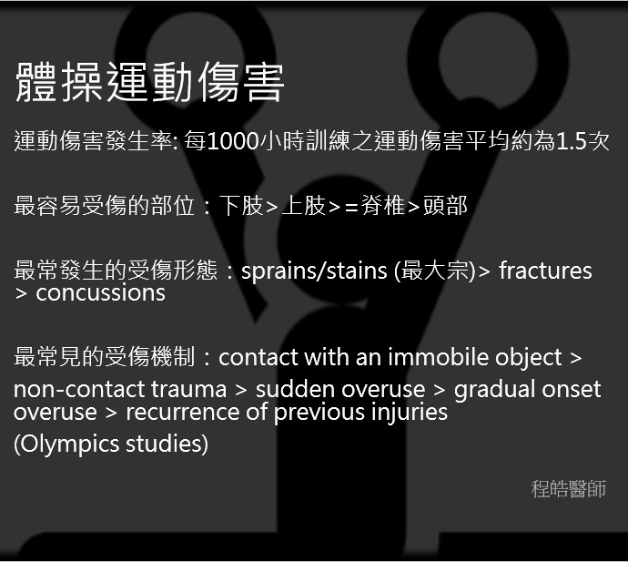

# 體操相關運動傷害

- 發文日期：2023-05-10
- 原文 URL：https://drchenghao.blogspot.com/2023/05/blog-post.html
- 抓取時間：2026-09-08T20:50:00+08:00
- 來源：程皓醫師。好動人生 (https://drchenghao.blogspot.com/)

---

[#體操相關運動傷害](https://www.facebook.com/hashtag/%E9%AB%94%E6%93%8D%E7%9B%B8%E9%97%9C%E9%81%8B%E5%8B%95%E5%82%B7%E5%AE%B3?__eep__=6&__cft__[0]=AZVsPO9MeLbAUOMp03mER8hqPBwQyYiBnscLjpq8jtyPd9hCDN7Qz2REtCl5goOomYQ1RxBpEOCzVCrvo2kps_Moixl3ECeB7qshSDLjektCSaKC95N7CjGRKTe2Ipga8uOjDcTXWmQCokm7ovifChxaqV11dz_p0hOdwrlP-898s_liHrDyNBHcZ2PJJ4N0BxY&__tn__=*NK-R)

下周二即將前往體大體育館擔任全大運競技體操的場邊醫師，開賽前整理體操相關運動傷害。禱告賽事期間一切順利!

[]總結: 體操運動傷害因為個別項目差異性非常大，因此具有非常多樣的運動傷害，而由於開始運動的年齡層相對較低，且具有高技巧及高難度之特性，因此急慢性運動傷害的比例都較高。與其他專項運動相比，手部承重的動作較多，因此手腕部分的傷害也非常常見。

醫師需要定期檢查年輕選手之生長板相關問題，及早給予診斷與處理，並且於訓練及賽事前中後密切關注選手之情況，以及早預防及處理傷害。
-------------------------------------------------------------------------
了解體操相關的運動傷害之前，首先需要知道體操細部的項目多，主要可分為三大項:
競技體操 (Artistic gymnastics) : 地板、鞍馬、吊環、跳馬、雙槓、單槓、平衡木、高低槓
韻律體操 (rhythmic gymnaststics): 繩操、球操、棒操、帶操、圈操
彈簧床體操(Trampoline gymnastics)、有氧體操、特技體操等等
(有興趣以輕鬆、有趣方式了解競技體操各項目，可以參考漫畫: 奧運高手，個人非常喜歡的一本漫畫，以輕鬆有趣、帶點感動的方式介紹競技體操)

體操運動傷害:
運動傷害發生率: 每1000小時訓練之運動傷害平均約為1.5次
最容易受傷的部位：下肢>上肢>=脊椎>頭部
最常發生的受傷形態：sprains/stains (最大宗)> fractures > concussions
最常見的受傷機制：contact with an immobile object > non-contact trauma > sudden overuse 15%, gradual onset overuse 11%, recurrence of previous injuries 14% (Olympics studies)

較高競技水準之運動員因為訓練時間較長、訓練難度較高，傷害機率也較高尤其以競技體操受傷率最高。由於體操選手的傷害種類眾多，需要在所有活動（訓練、比賽前熱身和比賽中）中密切注意，以預防及處理。

因為不同的體操運動有動作需求的不同，所以也容易導致不同的運動傷害，而在體操運動中，特別的是上肢(如鞍馬、跳馬、單槓與雙槓) 也承接了很大的體重負荷，根據動態動力學分析顯示，上肢承受的瞬間力量可以高達體重的16倍以上，因此手腕、肘與肩膀的上肢傷害機率也非常高。

常見運動傷害類型:
(1) 骨折與生長板傷害
(2) 手腕: palmar skin tears, distal radius Salter Type I fractures, triangular fibrocartilage complex tears, ulnar impaction syndrome with chondromalacia, lunate and triquetral pain, capsulitis, scaphoid stress fractures and dorsal wrist ganglia;
(2) 手肘: osteochondritis dissecans, medial epicondyle and olecranon apophysitis, triceps tendinitis, and acute dislocation;
(3) 肩膀: multidirectional instability with bicipital and rotator cuff tendonitis and impingement;
(4) 脊椎: spondylolysis (stress racture of the pars interarticularis), Scheuermann’s disease, lumbar facet syndrome, and discogenic pain;
(5) 膝蓋: patellofemoral syndrome, Osgood-Schlatter apophysitis, ligament and meniscus tears;
(6) 腳踝及足部: ligament tears, strains and apophysitis

A systematic review of injuries in gymnastics. 2018