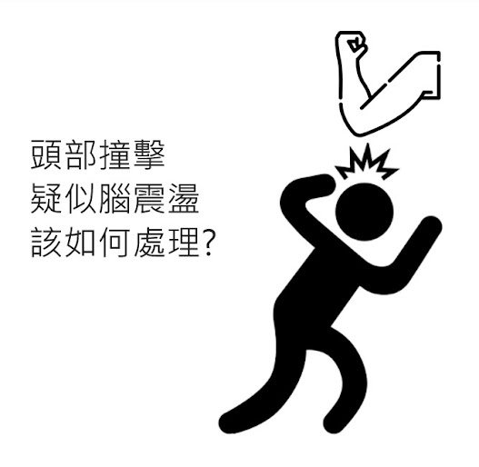

# 林書豪腦震盪後做了哪些檢查呢

- 發文日期：2023-05-20
- 原文 URL：https://drchenghao.blogspot.com/2023/05/blog-post_20.html
- 抓取時間：2026-09-08T20:50:00+08:00
- 來源：程皓醫師。好動人生 (https://drchenghao.blogspot.com/)

---

今年以前很少關注台籃，在魔獸及書豪來台後，也開始關注大小賽事，而今年初，鋼鐵人在林書豪加入後，帶領 2勝17敗，即將被聯盟thank you的鋼鐵人，一舉拉出一波連勝，有望衝擊季後賽，然而上週最後一戰，不幸因腦震盪退場，無緣在場上帶領鋼鐵人拿下最重要一勝，今天來探討林書豪下場後到底做了哪些腦震盪的評估呢？

運動性腦震盪（SRC: sport-related concussion）

「腦震盪」是指頭部受到直接或間接力量撞擊，撞擊力量使得腦部神經纖維受損或出血，導致腦部功能出現混亂並誘發相關症狀。

腦震盪依靠的是臨床症狀之綜合評估作為診斷，而非以單一影像或其他檢查診斷。

關於SRC 的識別、診斷、處置，總共有關鍵的11R，分別為 Recognise; Remove; Re-evaluate; Rest; Rehabilitation;
Refer; Recover; Return to sport; Reconsider; Residual effects and sequelae;
Risk reduction

今日就前四項 Recognise; Remove; Re-evaluate; Rest 作為主要討論

Recognise
& Remove:

場上出現明顯腦震盪徵象的球員，包含意識不清、平衡混亂、認知行為能力異常等症狀時，應立即停止參與運動。

當球員頭部受傷時，應立即先確定其生命徵象，以 ATLS、ACLS 對其進行評估，特別要注意排除頸椎受傷的可能性。

處理完急救問題後，應使用SCAT5或其他場邊評估工具對腦震盪傷害進行評估。

在受傷後的最初幾小時內，不應讓球員獨自一人，並需要持續監測其情況，以防止病情惡化。

已被診斷為腦震盪的球員不得在受傷當天返回比賽。

目前，SCAT5是場邊腦震盪評估中最成熟和嚴謹的檢查工具。適合給予13歲以上成年人進行腦震盪評估，而12歲以下則可以使用 Child SCAT。場邊評估時，SCAT可立即區分腦震盪和非腦震盪運動員，但其效用在受傷後3至5天內顯著降低。

SCAT5之評估可分為:

On
field : 分為四大階段，辨識 Red
flags 、腦震盪相關症狀、Maddock's
question、意識評估(Glasgow
Coma Scale) 與頸椎的檢查。

Off
field : 分為五大階段，病史以及球員狀況詢問、症狀評估、認知功能評估、神經學評估與記憶力評估。

SCAT-5 的檢查，規定至少必須是 10 分鐘以上才具有參考價值，若是少於 10 分鐘的評估時間，上過程一定不完整，所以無法採納。

Re-evaluate:

離開場邊至醫院後，後續檢查的應該包括：

全面的病史和詳細的神經學檢查，其中包括對精神狀態、認知功能、睡眠/清醒紊亂、眼睛功能、前庭功能、步態和平衡的全面評估。

評估受傷以來是否有改善或惡化，並且考慮安排進階之影像學檢查。

Rest:

Rest
the body, rest the brain 的觀念最為重要!

至少休息待症狀完全緩解後才考慮增加活動，急性期（受傷後24-48小時）短暫休息後，可以鼓勵患者逐漸增加活動量，但活動的水平不應引起或加重症狀。

----------------------------------------------------------------------

最後，做為一個球迷，希望腦震盪不會有任何後遺症，今年雖然沒有機會看到豪哥帶領鋼鐵人拿下總冠軍，但還是很希望林書豪下個賽季還能帶領球隊在台籃大殺四方，能看到他在台灣打球，真的是球迷的福氣呀~

以上內容參考自:

Consensus
statement on concussion in sport—the 5th international conference on concussion
in sport held in Berlin, October 2016

以及

[Dr. M Be Superior 運動醫學 傷害復健 健康促進](https://www.facebook.com/Dr.MBeSuperior?__cft__%5b0%5d=AZWCkqt2GJKJ6iYMO3nx8fz8EByyULroOP_P1egg1LuAjR5za1TpeklC8Zmc6nBTz5oZEpHSFjmfC5I6tRpqajHN9TWVxFkfaHpyHLLnVPjco-LtssAZ5d6oQKDxkwjgIDYIdOVqA7AJACwKRwNQdfzliieviU0sfl0QobhBQpzz9wvVHOxuZMayw1ozjx-kLok&__tn__=-%5dK-R)

非常精彩詳盡的內容

[https://www.drmbesuperior.com/....../%E8%85%A6%E9%9C......](https://www.drmbesuperior.com/post/%E8%85%A6%E9%9C%87%E7%9B%AA%E5%BE%8C%E5%8F%AF%E4%BB%A5%E4%B8%8A%E5%A0%B4%E5%97%8E%EF%BC%9F%E8%85%A6%E9%9C%87%E7%9B%AA%E7%9A%84%E8%A9%95%E4%BC%B0?fbclid=IwAR1jT-FmLDF3KJyrRdr_7PfJ4RNDgsL9KWA8TUzj_6jCX01AJ3T0_gFnuR0)